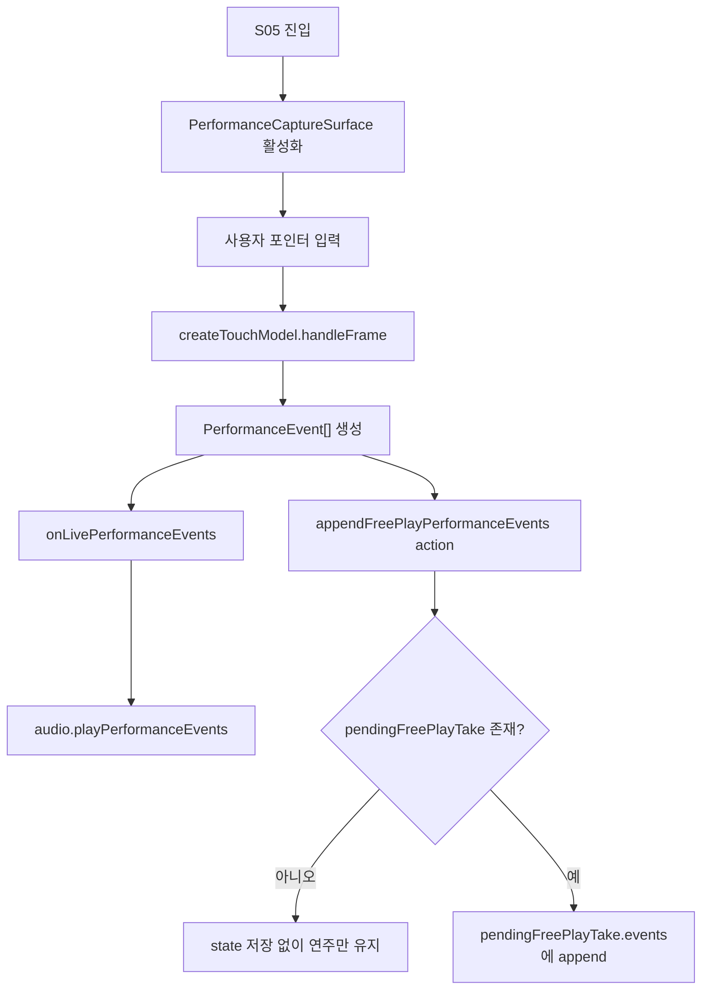

# S05 자유창작 연주 흐름

범위: S05 `악기 자유연주` 화면에 진입한 뒤 사용자가 직접 악기를 터치해 연주하는 코드 및 데이터 흐름.

관련 문서: `../product/screen-flow/current-screen-flow.md`, `runtime-architecture.md`, `../domain/README.md`, `../qa/day-4-touch-model-smoke.md`

## 결론

S05의 오른쪽 위 삼각형 버튼은 “연주 시작” 버튼이 아니다. 사용자는 S05에 진입하자마자 선택한 악기의 입력면을 터치해 연주할 수 있어야 한다. 삼각형 버튼은 현재 녹음 상태와 연결된 보조 컨트롤이며, 기본 연주 가능 여부를 켜는 조건이 아니다.

현재 구조에서는 `PerformanceCaptureSurface`가 화면 입력을 `PerformanceEvent[]`로 변환하고, `GarakScreenFlowApp`이 이를 `appendFreePlayPerformanceEvents` action과 live audio service boundary로 전달한다. 녹음이 시작되지 않은 상태의 이벤트는 즉시 발음에만 쓰이고, 녹음 중인 이벤트만 `pendingFreePlayTake.events`에 누적된다.

## 구현 화면 및 파일

| 구분 | 파일 | 역할 |
| --- | --- | --- |
| 화면 | `src/product/freeCreationScreens.tsx` | S05 자유연주 화면, 악기별 stage, 상단 컨트롤 배치 |
| 캡처 컴포넌트 | `src/interaction/PerformanceCaptureSurface.tsx` | 포인터 입력 수집, 터치 프레임 생성 |
| 입력 모델 | `src/product/freePlayTouchModel.ts` | 악기/화면 설정을 `TouchModel`로 변환 |
| 제스처 매핑 | `src/interaction/gestureMapper.ts` | tap, swipe, hold drag, cover, release를 연주 이벤트로 정규화 |
| 상태 전이 | `src/product/garakProductState.ts` | S05 진입, 이벤트 append, 녹음 완료 reducer |
| 화면 앱 | `src/product/GarakScreenFlowApp.tsx` | UI event와 product action, audio service 연결 |
| 효과 | `src/product/garakProductEffects.ts` | 저장/공유 등 외부 side effect 처리 |

## 진입 흐름

1. 사용자가 S04 악기 선택 화면에서 악기와 설정을 고른다.
2. `startFreePlayWithInstrumentSettings` action이 실행된다.
3. reducer는 `activeInstrumentSettings`를 갱신하고 S05로 이동한다.
4. 이 시점의 `pendingFreePlayTake`는 비어 있다. 즉, 연주는 가능하지만 저장 대상 take는 아직 없다.

## 연주 입력 흐름

## 핵심 상태

| 상태 | 의미 |
| --- | --- |
| `activeInstrumentSettings` | 현재 S05에서 연주할 악기와 악기별 설정 |
| `pendingFreePlayTake` | 녹음 중인 take 초안. 없으면 자유연주만 수행 |
| `freePlayNotice` | 저장 가능한 take가 없을 때 등 사용자 안내 상태 |
| `pendingLiveJangdanGuide` | 라이브 장단 가이드 설정 정보 |

## 연주와 녹음의 분리

연주 가능 여부는 `PerformanceCaptureSurface`의 활성화 여부로 결정한다. 녹음 여부는 `pendingFreePlayTake` 존재 여부로 결정한다.

따라서 S05에서는 다음 조건을 지켜야 한다.

| 조건 | 기대 동작 |
| --- | --- |
| S05 진입 직후 | 악기 입력면 터치 시 즉시 `PerformanceEvent[]`가 생성되고 발음된다 |
| 녹음 전 | 이벤트는 live audio로만 전달되고 library에는 저장되지 않는다 |
| 녹음 중 | 같은 이벤트가 live audio와 `pendingFreePlayTake.events` 양쪽으로 전달된다 |
| 녹음 완료 | `pendingFreePlayTake`가 `Work`, `InstrumentTrack`, `Take`로 저장된다 |

## 컨트롤 의미

| UI | action | 의미 |
| --- | --- | --- |
| 왼쪽 뒤로가기 | `back` | 이전 화면으로 이동 |
| 오른쪽 삼각형 버튼 | 녹음 전 `openFreePlayRecordingSetup`, 녹음 중 `completePerformance` | 녹음 설정 또는 연주 완료 컨트롤 |
| 오른쪽 주황 버튼 | `openLiveJangdanGuide` | 라이브 장단 가이드 설정 |

삼각형 버튼을 “연주 시작”으로 해석하면 안 된다. 연주는 화면 진입 직후 가능한 기본 상태이고, 삼각형 버튼은 녹음 흐름의 상태 전이를 담당한다.

## 현재 완료된 항목

- S05 진입 직후 입력 캡처가 가능하도록 연주 캡처와 녹음 저장 조건을 분리했다.
- `PerformanceCaptureSurface`가 생성한 이벤트를 live playback callback과 reducer dispatch로 나누어 전달한다.
- 녹음 중인 경우에만 이벤트를 `pendingFreePlayTake.events`에 누적한다.

## 남은 작업

구체 작업은 `../plans/backlog/2026-06-26-s05-performance-backlog.md`에서 관리한다.
