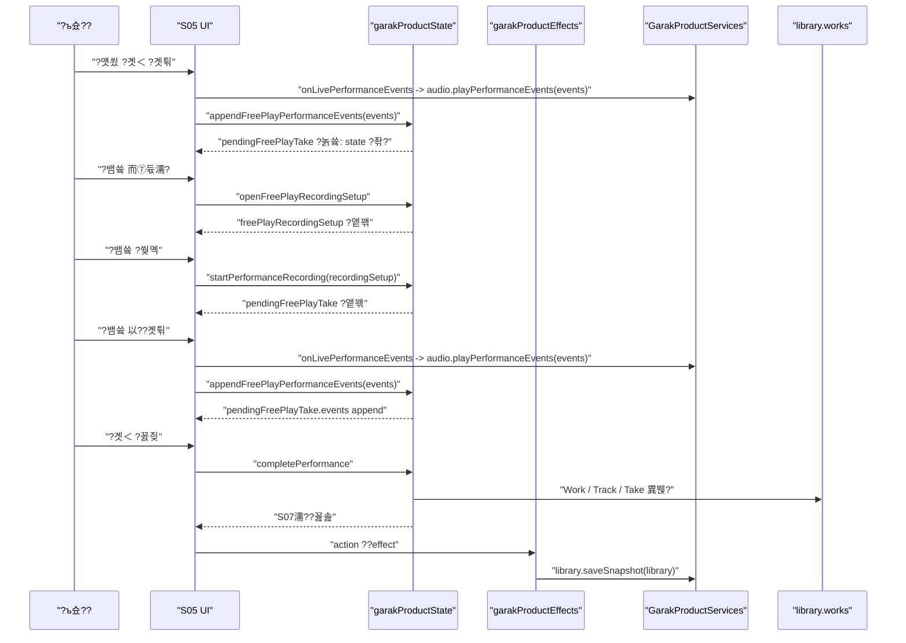

# S05 ?뱀쓬 湲곕뒫 ?먮쫫

?곹깭: 援ы쁽 諛섏쁺 諛?湲곕뒫 湲곗?
?묒꽦?? 2026-06-26
踰붿쐞: S05 `?낃린 ?먯쑀?곗＜` ?붾㈃?먯꽌 ?ъ슜?먭? ?먰븯??留뚰겮 ?먯쑀 ?곗＜?섎떎媛€ `?뱀쓬 ?쒖옉`???좏깮???? ?댄썑 ?낅젰 ?대깽?멸? ?대뼡 state?€ ?곗씠??援ъ“濡??꾩쟻?섍퀬 ?€?λ릺?붿????€??湲곗?
愿€??臾몄꽌: `free-play-performance-flow.md`, `runtime-architecture.md`, `../domain/README.md`, `../product/screen-flow/current-screen-flow.md`

## 寃곕줎

S05???뱀쓬?€ ?곗＜ 媛€???щ?瑜?耳쒕뒗 湲곕뒫???꾨땲?? ?ъ슜?먮뒗 S05??吏꾩엯?섏옄留덉옄 ?곗＜?????덇퀬, ?뱀쓬?€ ?ъ슜?먭? 紐낆떆?곸쑝濡??쒖옉???쒖젏 ?댄썑??`PerformanceEvent[]`留?`Take.events`濡?蹂댁〈?섎뒗 ?€??紐⑤뱶??

?쒗뭹 state?먯꽌 ?뱀쓬 以묒씤吏€ ?먮떒?섎뒗 湲곗??€ `pendingFreePlayTake !== undefined` ?섎굹?? `pendingFreePlayTake`媛€ ?앷린湲??꾩쓽 ?곗튂 ?대깽?몃뒗 ?쇱씠釉??ㅻ뵒???ъ깮 ?ы듃濡쒕쭔 ?꾨떖?섍퀬, ?뱀쓬 ?쒖옉 ?댄썑???곗튂 ?대깽?몃뒗 媛숈? ?쇱씠釉??ъ깮 寃쎈줈瑜??€硫댁꽌 `pendingFreePlayTake.events`?먮룄 ?꾩쟻?쒕떎.

## 湲곗? ?먮쫫

```text
S05 吏꾩엯
  -> ?먯쑀 ?곗＜ 媛€??  -> ?ъ슜?먭? ?뱀쓬 而⑦듃濡??좏깮
  -> freePlayRecordingSetup ?앹꽦 ?먮뒗 ?쒖떆
  -> ?λ떒 / BPM / 諛뺤옄 ?뺤씤
  -> ?뱀쓬 ?쒖옉
  -> pendingFreePlayTake ?앹꽦
  -> ?댄썑 PerformanceEvent[]瑜?pendingFreePlayTake.events??append
  -> ?곗＜ ?꾨즺
  -> pendingFreePlayTake瑜?Work / InstrumentTrack / Take濡??먮룞 ?€??  -> pendingFreePlayTake ?쒓굅
  -> S07 ?몃옓/?덉씠???몄쭛?쇰줈 ?대룞
```

## ?곹깭 梨낆엫

| state ?꾨뱶 | ?뱀쓬?먯꽌???섎? |
| --- | --- |
| `freePlayRecordingSetup` | ?뱀쓬 ?쒖옉 ???ъ슜?먭? ?뺤씤 以묒씤 ?λ떒, BPM, 諛뺤옄 ?ㅼ젙 |
| `pendingFreePlayTake` | ?뱀쓬 以묒씤 ?묒꽦 以?take. ??媛믪씠 ?덉쑝硫??뱀쓬 以묒씠??|
| `pendingFreePlayTake.events` | ?뱀쓬 ?쒖옉 ?댄썑 ?꾩쟻??`PerformanceEvent[]` |
| `pendingFreePlayTake.recordingSetup` | ?뱀쓬 ?쒖옉 ?쒓컙 ?뺤젙??`RecordingSetup` ?ㅻ깄??|
| `pendingLiveJangdanGuide` | ?꾨즺 ?€????take??遺숈씪 ?쇱씠釉??λ떒 媛€?대뱶 ?뺣낫 |
| `activeInstrumentSettings` | ?꾨즺 ?€????take??遺숈씪 ?낃린 ?ㅼ젙媛?|
| `library.works` | ?꾨즺 ???앹꽦??`Work`媛€ 異붽??섎뒗 ?곸냽 ?€??|
| `currentWorkId` | ?꾨즺 ??諛⑷툑 ?앹꽦???묒뾽 id |
| `counters` | ?꾨즺 ??`work`, `track`, `take` id ?앹꽦???꾪빐 利앷? |
| `freePlayNotice` | ?€??媛€?ν븳 take媛€ ?놁쓣 ??`missingTake` ?덈궡 ?쒖떆 |

## ?뱀쓬 ???ㅼ젙 ?닿린

?뱀쓬 而⑦듃濡ㅼ? `openFreePlayRecordingSetup`??dispatch?쒕떎. 媛€濡?S05?먯꽌???ㅻⅨ履????쇨컖??踰꾪듉???뱀쓬 ?꾩뿉????action??蹂대궦?? ?몃줈 fallback UI?먯꽌??`?뱀쓬` 踰꾪듉??媛숈? action??蹂대궦??

```text
openFreePlayRecordingSetup
  -> freePlayRecordingSetup = state.freePlayRecordingSetup ?? createRecordingSetupSuggestion(state)
  -> freePlayNotice = undefined
```

`createRecordingSetupSuggestion`?€ ?쇱씠釉??λ떒 媛€?대뱶媛€ ?덉쑝硫?洹?媛믪쓣 ?곗꽑?쒕떎.

```text
if pendingLiveJangdanGuide exists:
  createRecordingSetup(pendingLiveJangdanGuide.presetId, pendingLiveJangdanGuide.bpm)
else:
  createDefaultRecordingSetup()
```

???④퀎?먯꽌 ?꾩쭅 ?뱀쓬?€ ?쒖옉?섏? ?딅뒗??

- `pendingFreePlayTake`???앹꽦?섏? ?딅뒗??
- ?먯쑀 ?곗＜??怨꾩냽 媛€?ν븯??
- 湲곗〈 ?쇱씠釉??대깽?몃뒗 `Take.events`???뚭툒 ?€?λ릺吏€ ?딅뒗??
- ?쇱씠釉뚮윭由??€?μ씠??work ?앹꽦???쇱뼱?섏? ?딅뒗??

## ?ㅼ젙 蹂€寃?
?ㅼ젙 ?쒗듃?먯꽌 ?λ떒 ?꾨━?뗭쓣 怨좊Ⅴ硫?`selectFreePlayRecordingPreset`???ㅽ뻾?쒕떎.

```text
selectFreePlayRecordingPreset
  -> freePlayRecordingSetup = createRecordingSetup(action.presetId)
  -> freePlayNotice = undefined
```

BPM 議곗젅?€ `adjustFreePlayRecordingBpm`??泥섎━?쒕떎.

```text
adjustFreePlayRecordingBpm
  -> setup = state.freePlayRecordingSetup ?? createDefaultRecordingSetup()
  -> freePlayRecordingSetup = adjustRecordingSetupBpm(setup, action.delta)
  -> freePlayNotice = undefined
```

`createRecordingSetup`?€ ?꾨━?뗭쓽 `beatUnit`???ъ슜?섍퀬, BPM?€ ?대떦 ?꾨━?뗭쓽 `minBpm`怨?`maxBpm` ?ъ씠濡?clamp?쒕떎. ?곕씪??UI媛€ ?섎せ??BPM??蹂대궡??reducer ?덉쓽 `RecordingSetup`?€ ?뺢퇋?붾맂 媛믪씠?댁빞 ?쒕떎.

痍⑥냼??`cancelFreePlayRecordingSetup`??泥섎━?쒕떎.

```text
cancelFreePlayRecordingSetup
  -> freePlayRecordingSetup = undefined
```

痍⑥냼?대룄 ?먯쑀 ?곗＜??怨꾩냽 媛€?ν븯怨? ?대? ?뱀쓬 以묒씤 `pendingFreePlayTake`媛€ ?덈떎硫?reducer???대? ?쒓굅?섏? ?딅뒗?? ?ㅻ쭔 S05 ?쒗뭹 UI???뱀쓬 以묒뿉??湲곕낯?곸쑝濡??꾨즺 ?숈옉???곗꽑?댁빞 ?쒕떎.

## ?뱀쓬 ?쒖옉

?ъ슜?먭? ?ㅼ젙 ?쒗듃??`?뱀쓬 ?쒖옉`???꾨Ⅴ硫?`startPerformanceRecording`???ㅽ뻾?쒕떎.

```text
startPerformanceRecording
  -> pendingFreePlayTake = {
       events: action.events ?? [],
       recordingSetup: normalizeRecordingSetup(
         action.recordingSetup
         ?? state.freePlayRecordingSetup
         ?? createDefaultRecordingSetup()
       ),
       startedAtMs: Date.parse(state.now())
     }
  -> freePlayRecordingSetup = undefined
  -> freePlayNotice = undefined
```

???쒖젏遺€??`pendingFreePlayTake !== undefined`?대?濡??쒗뭹?€ ?뱀쓬 以??곹깭?? `FreePlayContent`????媛믪쓣 `isRecordingPerformance`濡??ъ슜???뱀쓬/?꾨즺 踰꾪듉 ?곹깭瑜?諛붽씔?? 諛섎?濡??곗튂 ?낅젰 媛€???щ???`captureEnabled = true`濡??좎??섏뼱???쒕떎.

?뱀쓬 ?쒖옉???댁빞 ?섎뒗 ??

- ?뱀쓬 ?쒖옉 ?쒓컙??`RecordingSetup`??`pendingFreePlayTake.recordingSetup`???ㅻ깄?룹쑝濡?怨좎젙?쒕떎.
- ?댄썑 ?낅젰 ?대깽?몃? ?댁쓣 `events` 諛곗뿴??以€鍮꾪븳??
- ?ㅼ젙 ?쒗듃瑜??ル뒗??
- ?댁쟾 `missingTake` ?덈궡瑜?吏€?대떎.

?뱀쓬 ?쒖옉???섏? 留먯븘???섎뒗 ??

- S05 ?낅젰 罹≪쿂瑜??덈줈 耳쒕뒗 梨낆엫??媛뽰? ?딅뒗?? ?낅젰 罹≪쿂???대? 耳쒖졇 ?덉뼱???쒕떎.
- ?뱀쓬 ?쒖옉 ???먯쑀 ?곗＜ ?대깽?몃? ?먮룞?쇰줈 ?뚭툒 ?€?ν븯吏€ ?딅뒗??
- `Work`, `Track`, `Take`瑜??꾩쭅 ?앹꽦?섏? ?딅뒗??
- `library.works` ?먮뒗 ?먭꺽 ?€?μ냼瑜??꾩쭅 媛깆떊?섏? ?딅뒗??

`startPerformanceRecording.events`???뚯뒪?몃굹 ?쒖뼱???몄텧?먯꽌 ?쒖옉 ?대깽?몃? ?④퍡 ?ｊ린 ?꾪븳 ?좏깮 ?꾨뱶?? ?꾩옱 S05 ?ㅼ젙 ?쒗듃??`recordingSetup`留?蹂대궡誘€濡??쇰컲 ?ъ슜???먮쫫?먯꽌??鍮?諛곗뿴濡??쒖옉?쒕떎.

## ?뱀쓬 以??대깽???꾩쟻

S05 ?낅젰硫댁뿉???곗튂媛€ ?ㅼ뼱?ㅻ㈃ `PerformanceCaptureSurface`媛€ raw touch瑜?`TouchFrame`?쇰줈 留뚮뱾怨? `createTouchModel.handleFrame`???대? `PerformanceEvent[]`濡?蹂€?섑븳??

```text
TouchFrame
  -> createTouchModel.handleFrame
  -> PerformanceEvent[]
  -> onLivePerformanceEvents
  -> appendFreePlayPerformanceEvents
```

`appendFreePlayPerformanceEvents` action?€ ??寃쎈줈瑜??숈떆??留뚮뱺??

1. live playback 寃쎈줈: `PerformanceCaptureSurface`媛€ `onLivePerformanceEvents`瑜?癒쇱? ?몄텧???쇱씠釉?諛쒖쓬???붿껌?쒕떎.
2. reducer 寃쎈줈: `pendingFreePlayTake`媛€ ?덉쓣 ?뚮쭔 ?대깽?몃? `pendingFreePlayTake.events` ?ㅼ뿉 遺숈씤??

reducer 湲곗??€ ?ㅼ쓬怨?媛숇떎.

```text
appendFreePlayPerformanceEvents
  if pendingFreePlayTake is undefined:
    return state
  if action.events.length === 0:
    return state
  else:
    pendingFreePlayTake.events = [
      ...pendingFreePlayTake.events,
      ...action.events
    ]
    freePlayNotice = undefined
```

?곕씪???뱀쓬 以묒뿉???대깽???쒖꽌媛€ append ?쒖꽌濡?蹂댁〈?쒕떎. 諛섎㈃ ?뱀쓬 ???먯쑀 ?곗＜ ?대깽?몃뒗 ?쇱씠釉??ㅻ뵒???ы듃濡쒕뒗 ?꾨떖?섏?留? reducer??state瑜?諛붽씀吏€ ?딅뒗??

## ?꾨즺 ?€??
?ъ슜?먭? ?뱀쓬 以??ㅻⅨ履????쇨컖??踰꾪듉???꾨Ⅴ硫?`completePerformance`媛€ ?ㅽ뻾?쒕떎. ?몃줈 fallback UI?먯꽌??`?꾨즺` 踰꾪듉??媛숈? action??蹂대궦??

?€?ν븷 `pendingFreePlayTake`媛€ ?놁쑝硫?work瑜?留뚮뱾吏€ ?딅뒗??

```text
completePerformance
  if pendingFreePlayTake is undefined:
    freePlayRecordingSetup = undefined
    freePlayNotice = 'missingTake'
    return state
```

`pendingFreePlayTake`媛€ ?덉쑝硫?work, track, take id瑜?留뚮뱾怨?`autoSaveTakeAsWork`瑜??몄텧?쒕떎.

```text
completePerformance
  -> counters.work / counters.track / counters.take 利앷?
  -> now = state.now()
  -> instrument = state.selectedInstrument ?? DEFAULT_FREE_CREATION_INSTRUMENT
  -> takeEvents = action.events ?? pendingFreePlayTake.events
  -> instrumentSettings = getRecordingInstrumentSettings(state, instrument)
  -> work = autoSaveTakeAsWork({
       workId: `work-${counters.work}`,
       trackId: `track-${counters.track}`,
       takeId: `take-${counters.take}`,
       title: `${getInstrumentName(instrument)} ?묒뾽 ${counters.work}`,
       instrument,
       events: takeEvents,
       createdAt: now,
       startedAtBeat: 1,
       durationBeats: getPerformanceTakeDurationBeats(takeEvents, pendingFreePlayTake.recordingSetup),
       instrumentSettings,
       recordingSetup: pendingFreePlayTake.recordingSetup,
       liveJangdanGuide: pendingLiveJangdanGuide ? {
         presetId,
         bpm,
         volume,
         startedAtBeat: 1
       } : undefined
     })
```

?꾨즺 ???쒗뭹 state???ㅼ쓬泥섎읆 諛붾€먮떎.

```text
library.works += work
currentWorkId = work.id
workPlayheadBeat = 1
pendingFreePlayTake = undefined
freePlayRecordingSetup = undefined
freePlayNotice = undefined
workSaveStatus = undefined
pendingLiveJangdanGuide = undefined
screenFlow = completePerformance transition to S07
```

洹??ㅼ쓬 `runGarakProductEffect`媛€ `completePerformance`瑜??쇱씠釉뚮윭由?蹂€寃?action?쇰줈 蹂닿퀬 `services.library.saveSnapshot(state.library)`瑜??몄텧?쒕떎. ?€??effect媛€ ?ㅽ뙣?대룄 reducer媛€ 留뚮뱺 optimistic local state???좎??쒕떎.

## ?€???곗씠??援ъ“

`autoSaveTakeAsWork`媛€ 留뚮뱶???€??援ъ“???ㅼ쓬怨?媛숇떎.

```text
Work
  id: work-N
  title: "{?낃린紐? ?묒뾽 N"
  source: "free_creation"
  syncState: "local_only"
  createdAt: now
  updatedAt: now
  tracks[0]: InstrumentTrack
    id: track-N
    kind: "instrument"
    instrument: selectedInstrument
    startedAtBeat: 1
    volume: 1
    mute: false
    solo: false
    createdAt: now
    takes[0]: Take
      id: take-N
      events: pendingFreePlayTake.events
      startedAtBeat: 1
      durationBeats: getPerformanceTakeDurationBeats(events, recordingSetup)
      recordingSetup: pendingFreePlayTake.recordingSetup
      liveJangdanGuide?: pendingLiveJangdanGuide snapshot
      instrumentSettings: activeInstrumentSettings or default settings
```

`Take.recordingUri`???꾩옱 S05 ?먯쑀?곗＜ ?뱀쓬 ?먮쫫?먯꽌 ?앹꽦?섏? ?딅뒗?? ?꾩옱 湲곗? ?€?μ쓽 ?듭떖 ?먮낯?€ `PerformanceEvent[]`??

## 遺덈? 議곌굔

- S05 ?낅젰 罹≪쿂 媛€???щ??€ ?뱀쓬 以??щ???遺꾨━?쒕떎.
- ?뱀쓬 以??щ???`pendingFreePlayTake !== undefined`濡쒕쭔 ?먮떒?쒕떎.
- `pendingFreePlayTake.recordingSetup`?€ ?뱀쓬 ?쒖옉 ?쒓컙???뺢퇋?붾맂 ?ㅼ젙?댁뼱???쒕떎.
- ?뱀쓬 ???대깽?몃뒗 ?먮룞?쇰줈 `Take.events`???ㅼ뼱媛€硫????쒕떎.
- ?뱀쓬 以?`appendFreePlayPerformanceEvents`??湲곗〈 ?대깽???ㅼ뿉 ???대깽?몃? 遺숈씤??
- ?꾨즺 ?꾩뿉??`library.works`?????묒뾽??留뚮뱾吏€ ?딅뒗??
- ?꾨즺 ?꾩뿉??`pendingFreePlayTake`?€ `freePlayRecordingSetup`??鍮꾩썙???쒕떎.
- ?€??媛€?ν븳 take ?놁씠 ?꾨즺?섎㈃ `freePlayNotice = 'missingTake'`留??④린怨?library瑜?諛붽씀吏€ ?딅뒗??

## 媛쒖꽑 諛깅줈洹?
??臾몄꽌???꾩옱 ?뱀쓬 ?숈옉怨?state 湲곗????ㅻ챸?쒕떎. ?뱀쓬 寃쏀뿕?먯꽌 諛붽퓭?????묒뾽 ??ぉ?€ `../plans/backlog/2026-06-26-s05-recording-backlog.md`瑜?湲곗??쇰줈 異붿쟻?쒕떎.

## ?쒖꽌??

