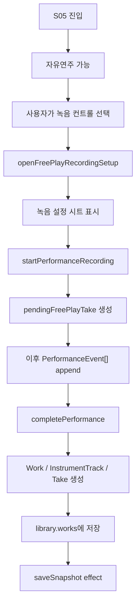

# S05 자유창작 녹음 흐름

범위: S05 `악기 자유연주` 화면에서 사용자가 자유롭게 연주하다가 `녹음 시작`을 선택한 뒤, 데이터와 state가 어떻게 누적되고 저장되는지 설명한다.

관련 문서: `free-play-performance-flow.md`, `runtime-architecture.md`, `../domain/README.md`, `../product/screen-flow/current-screen-flow.md`

## 결론

녹음은 연주 가능 여부를 켜는 기능이 아니다. S05에서는 진입 직후부터 연주가 가능하고, 녹음은 특정 시점 이후의 `PerformanceEvent[]`만 `Take.events`로 보존하는 저장 모드다.

제품 state에서 녹음 중 여부를 판단하는 기준은 `pendingFreePlayTake !== undefined`다. 녹음 시작 전 이벤트는 live playback에만 사용하고, 녹음 시작 후 이벤트는 live playback에 전달하면서 동시에 `pendingFreePlayTake.events`에 누적한다.

## 구현 화면 및 파일

| 구분 | 파일 | 역할 |
| --- | --- | --- |
| 화면 | `src/product/freeCreationScreens.tsx` | S05 녹음/완료 컨트롤, 녹음 설정 시트 |
| 상태 전이 | `src/product/garakProductState.ts` | `openFreePlayRecordingSetup`, `startPerformanceRecording`, `appendFreePlayPerformanceEvents`, `completePerformance` 처리 |
| 캡처 | `src/interaction/PerformanceCaptureSurface.tsx` | 녹음 여부와 무관하게 연주 이벤트 생성 |
| 화면 앱 | `src/product/GarakScreenFlowApp.tsx` | 연주 이벤트를 live playback과 reducer로 전달 |
| 저장 효과 | `src/product/garakProductEffects.ts` | 완료된 work/library snapshot 저장 |
| 도메인 타입 | `src/studio/studioTypes.ts` | `Work`, `InstrumentTrack`, `Take`, `PerformanceEvent` |

## 전체 흐름



## 녹음 시작

`openFreePlayRecordingSetup`은 녹음 설정 시트를 열고, 사용자가 BPM/장단/박자 단위를 확인한 뒤 `startPerformanceRecording`을 실행한다.

`startPerformanceRecording`이 수행하는 일:

1. 기존 `pendingFreePlayTake`가 있으면 덮어쓰지 않고 보존한다.
2. 현재 악기 설정과 녹음 설정을 기준으로 take 초안을 만든다.
3. `startedAtMs`를 기록한다.
4. `events`는 빈 배열로 시작한다.
5. 화면은 S05에 머물며 사용자는 계속 연주한다.

## 이벤트 누적

`PerformanceCaptureSurface`는 녹음 상태와 무관하게 이벤트를 만든다. 차이는 reducer에서 저장할지 여부다.

| 상태 | 이벤트 처리 |
| --- | --- |
| 녹음 전 | `onLivePerformanceEvents`로 발음만 요청 |
| 녹음 중 | 발음 요청 후 `pendingFreePlayTake.events`에 append |
| 녹음 완료 후 | `pendingFreePlayTake`가 제거되고 다시 자유연주 상태가 된다 |

이 구조 덕분에 사용자는 녹음 버튼을 누르기 전에도 악기를 테스트하고, 원하는 순간부터만 take를 남길 수 있다.

## 녹음 완료

사용자가 완료 컨트롤을 누르면 `completePerformance`가 실행된다.

`pendingFreePlayTake`가 없으면:

- library를 변경하지 않는다.
- `freePlayNotice = 'missingTake'`로 안내한다.

`pendingFreePlayTake`가 있으면:

1. 새 `Work` id를 만든다.
2. 선택 악기 기준의 `InstrumentTrack`을 만든다.
3. 누적된 이벤트를 담은 `Take`를 만든다.
4. 이벤트 timestamp, `startedAtMs`, BPM을 기준으로 `durationBeats`를 계산한다.
5. `library.works`에 새 work를 추가한다.
6. `pendingFreePlayTake`를 제거한다.
7. `selectedPlayerItem`을 새 work로 이동시킨다.

## 저장 데이터 형태

저장 결과는 대략 다음 구조를 갖는다.

```ts
Work {
  id,
  title,
  source: 'free_creation',
  tracks: [
    InstrumentTrack {
      id,
      instrument,
      volume: 1,
      takes: [
        Take {
          id,
          events,
          durationBeats,
          startedAtMs,
          recordingSetup
        }
      ]
    }
  ]
}
```

## 현재 완료된 항목

- 자유연주와 녹음 저장 조건을 분리했다.
- 녹음 시작 전 이벤트는 저장하지 않고, 녹음 중 이벤트만 `Take.events`로 누적한다.
- `startedAtMs`를 기준으로 take 시작 시점을 보존한다.
- 완료 시 이벤트 길이를 기준으로 `durationBeats`를 계산한다.

## 남은 작업

구체 작업은 `../plans/backlog/2026-06-26-s05-recording-backlog.md`에서 관리한다.
