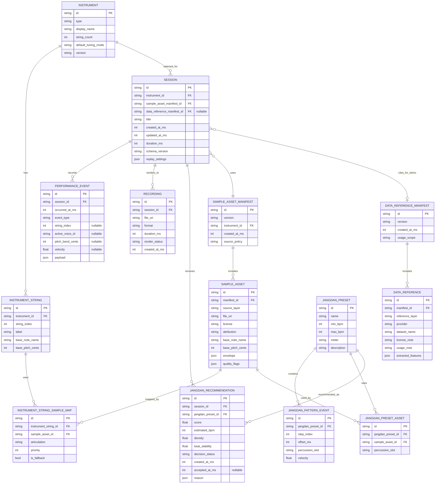
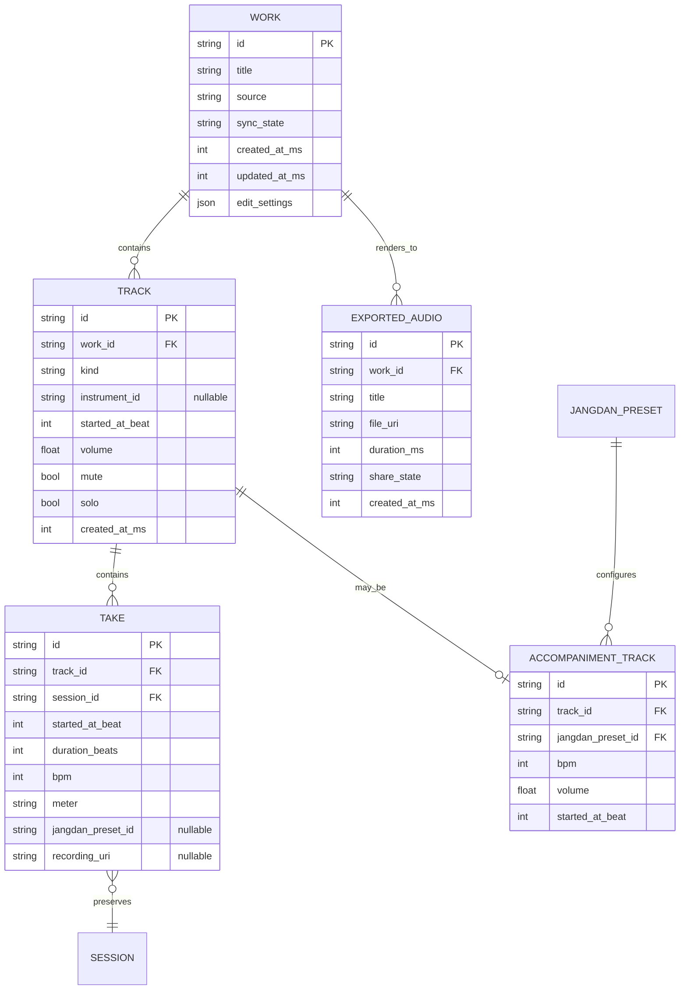
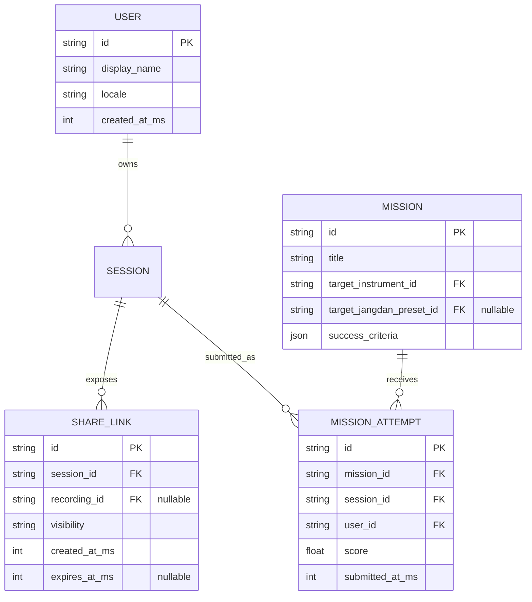

# GARAK ERD

이 문서는 팀원 공유를 위한 GARAK MVP의 도메인 데이터 모델이다.

현재 MVP에서 이 ERD는 반드시 관계형 DB를 만들겠다는 뜻이 아니다. 로컬 JSON, SQLite, IndexedDB, Supabase, Firebase 등 어떤 저장소를 쓰더라도 유지해야 하는 엔티티 관계와 직렬화 구조를 정의한다.

문서 책임: 저장소 독립적인 엔티티 관계와 직렬화 구조를 정의한다. 도메인 용어와 불변조건은 `../domain/README.md`를 따르고, 구체 기술 스택은 `tech-stack.md`를 따른다.

현재 ERD의 상세 입력면은 가야금 프로토타입에서 출발한다. 제품 기준의 MVP 악기 범위는 가야금, 장구, 대금이며, 세 악기는 같은 `Session`과 `PerformanceEvent` 경계를 공유한다.

## 모델링 원칙

- `Session`이 사용자의 연주 데이터를 보존하는 기준 데이터다.
- `PerformanceEvent`는 리플레이 가능한 연주의 최소 기록 단위다.
- 자유창작의 편집 가능한 사용자 작업 단위는 `Work`다.
- `Work`는 여러 `Track`과 `Take`를 묶어 하나의 곡 후보를 만든다.
- 녹음 직전에 정한 BPM, 박자, 장단은 `Take` 또는 `Work` 편집 맥락에 보존한다.
- `Recording`은 `Session`에서 렌더링된 선택적 산출물이며, 기준 데이터가 아니다.
- `SampleAssetManifest`는 실제 재생 가능한 오디오 에셋 목록이다.
- `DataReferenceManifest`는 분석/검증/심사용 근거 데이터 목록이며, 재생 에셋과 섞지 않는다.
- 장단 AI는 오디오 생성 모델이 아니라 `PerformanceEvent`를 분석해 `JangdanPreset`을 추천하는 계층이다.
- MVP에서는 사용자 계정, 클라우드 라이브러리, 커뮤니티 피드 엔티티를 제외한다. 단, `Session`과 `Work`는 추후 계정 기반 저장소로 이전할 수 있도록 직렬화 가능해야 한다.

## Core ERD



## Studio Work / Layer Model

자유창작 화면에서 사용자가 체감하는 저장 단위는 단일 `Session`보다 상위의 `Work`다. `Work`는 여러 레이어를 가진 편집 가능한 곡 후보이며, 서버 저장이 붙을 경우 1차 전송 단위의 후보가 된다.



- `Work.sync_state`는 `local_only`, `synced`, `account_only`, `conflict` 같은 상태로 로컬 저장과 서버 동기화를 분리한다.
- `Take`는 녹음 직전 확정한 BPM, 박자, 장단을 보존한다.
- `ExportedAudio`는 공유/재생용 산출물이며, 편집 가능한 Work를 대체하지 않는다.
- 단일 `Session`을 서버에 저장할지, `Work`와 `ExportedAudio`만 서버에 저장할지는 백엔드 API 계약에서 확정한다.

## Entity Notes

| 엔티티 | 역할 | MVP 구현 메모 |
| --- | --- | --- |
| `Instrument` | 가야금, 장구, 대금 등 악기 정의 | MVP 제품 범위는 `12_string_gayageum`, `janggu`, `daegeum`이다. |
| `InstrumentString` | 가야금 전용 현별 기준 음고와 표시 정보 | 12개 현은 버튼 배열이 아니라 독립 입력/발음 객체다. |
| `Session` | 연주의 기준 데이터 | 로컬 저장의 최상위 JSON 문서가 될 수 있다. |
| `PerformanceEvent` | 연주 이벤트 로그 | 현재 구현된 가야금 이벤트는 `string_pluck`, `glissando_step`, `string_bend`, `string_mute`, `string_release`다. |
| `Work` | 여러 트랙/레이어를 묶는 자유창작 작업 | 보관함의 `작업` 탭에 노출하며 서버 저장의 1차 후보가 될 수 있다. |
| `Track` | Work 안의 악기/반주/참조 레이어 | DAW 수준 타임라인이 아니라 MVP 레이어 편집 단위다. |
| `Take` | 녹음 한 번으로 생긴 연주 이벤트 묶음 | 녹음 직전 BPM, 박자, 장단 맥락을 함께 저장한다. |
| `ExportedAudio` | Work에서 렌더링한 공유/재생용 산출물 | 보관함의 `내보낸 음원` 탭과 공유 준비 흐름에서 사용한다. |
| `Recording` | 오디오 렌더링 결과 | 실패해도 `Session` 리플레이는 보존되어야 한다. |
| `SampleAssetManifest` | 재생 에셋 버전 목록 | 리플레이 시 같은 샘플 환경을 찾기 위해 `Session`에 버전을 남긴다. |
| `SampleAsset` | 실제 소리 파일과 메타데이터 | `source_layer`는 `public_asset` 또는 `own_asset`만 허용한다. |
| `DataReferenceManifest` | 분석/검증 데이터 버전 목록 | 재생 에셋과 분리한다. 심사용 인스펙터가 참조할 수 있다. |
| `DataReference` | 공공데이터/AI Hub 등 참조 데이터 | 원본을 앱에 통배포하지 않고 추출 특징과 활용 메모를 기록한다. |
| `JangdanPreset` | 장단 프리셋 | 중모리, 굿거리, 자진모리 등 제한된 로컬 프리셋으로 시작한다. |
| `JangdanRecommendation` | 장단 추천 결과 | 자동 적용하지 않고 `proposed -> previewed -> accepted/rejected` 흐름을 따른다. |

## Session JSON Shape

MVP에서는 아래 가야금 예시처럼 `Session`을 하나의 직렬화 가능한 문서로 저장할 수 있다.

```json
{
  "id": "session_001",
  "schemaVersion": "2026.06.mvp",
  "instrumentId": "12_string_gayageum",
  "sampleAssetManifestId": "gayageum_samples_2026_06_a",
  "dataReferenceManifestId": "gukak_references_2026_06_a",
  "title": "first-arirang-session",
  "createdAtMs": 1790940000000,
  "durationMs": 28000,
  "replaySettings": {
    "baseBpm": 90,
    "tuningMode": "mvp_default"
  },
  "events": [
    {
      "id": "event_001",
      "occurredAtMs": 0,
      "eventType": "string_pluck",
      "stringIndex": 5,
      "velocity": 0.74,
      "payload": {}
    },
    {
      "id": "event_002",
      "occurredAtMs": 320,
      "eventType": "string_bend",
      "stringIndex": 5,
      "pitchBendCents": 22,
      "payload": {
        "gestureAxis": "y"
      }
    }
  ],
  "jangdanRecommendations": [
    {
      "id": "recommendation_001",
      "jangdanPresetId": "gutgeori",
      "score": 0.82,
      "estimatedBpm": 92,
      "density": 0.38,
      "beatStability": 0.71,
      "decisionStatus": "proposed",
      "reason": {
        "primarySignal": "estimated_bpm",
        "message": "BPM과 터치 밀도가 굿거리 범위에 가깝다."
      }
    }
  ],
  "recordings": []
}
```

## Relationship Rules

- `Session`은 반드시 하나의 `Instrument`와 하나의 `SampleAssetManifest`를 참조한다.
- `Session`은 `DataReferenceManifest`를 선택적으로 참조한다. 일반 런타임에는 없어도 되지만, 데모 인스펙터와 심사용 근거 표시에는 유용하다.
- `PerformanceEvent`는 반드시 `Session`에 속한다. 세션 밖의 독립 이벤트는 저장하지 않는다.
- `Recording`은 반드시 `Session`에서 파생된다. `Recording`만으로는 연주 맥락을 복구할 수 없다.
- `SampleAsset`은 반드시 하나의 `SampleAssetManifest`에 속한다.
- `DataReference`는 반드시 하나의 `DataReferenceManifest`에 속한다.
- `JangdanRecommendation`은 반드시 `Session`에 속하며, 하나의 `JangdanPreset` 후보를 가리킨다.
- 추천된 장단은 자동 적용하지 않는다. `decision_status`가 `accepted`일 때만 `LocalSequencer`가 해당 프리셋을 세션 반주로 사용한다.

## MVP Exclusions

아래 엔티티는 MVP ERD에서 제외한다.

- `User`, `Account`, `AuthProvider`: MVP는 로컬 세션 중심으로 검증한다.
- `CommunityPost`, `Comment`, `Like`: 내부 커뮤니티 피드는 MVP 범위가 아니다.
- `RemoteCollaborationRoom`: 실시간 원격 합주는 MVP 범위가 아니다.
- `NotationScore`, `JeongganboEditor`: 정간보 편집기는 MVP 범위가 아니다.
- `DawTrack`, `MidiNote`, `TimelineClip`: Studio는 DAW가 아니므로 전문 타임라인 편집 모델은 MVP 데이터 모델에 두지 않는다. 단, `Work` 안의 MVP `Track`은 레이어 편집 단위로 사용한다.

## Future Extension Points

추후 확장 시 아래 관계를 추가할 수 있다.



이 확장 엔티티들은 MVP에서 구현하지 않는다. 다만 현재 `Session` 구조가 JSON 직렬화와 외부 저장소 이전을 전제로 설계되어야 하는 이유를 보여주는 참조 모델로만 둔다.
