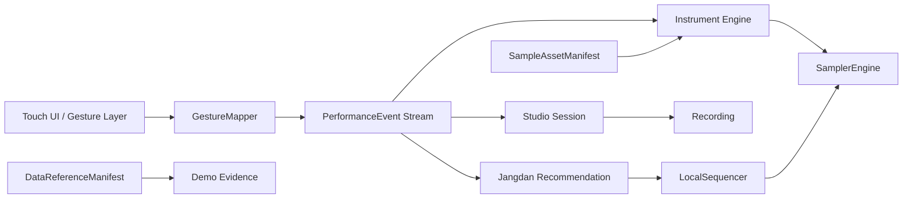

# GUKAK STUDIO Domain Model

상태: MVP 기준 canonical domain document  
범위: 12현 가야금 MVP, 로컬 세션, 장단 추천 데모  
관련 문서: `../architecture/gukak-studio-erd.md`, `../architecture/runtime-architecture.md`

이 문서는 GUKAK STUDIO의 DDD 기준 도메인 언어를 정의한다. 코드 타입, UI 라벨, ERD 이름은 이 문서의 용어를 따른다.

## Core Domain

GUKAK STUDIO의 core domain은 `Instrument Performance`다. 사용자가 모바일 화면에서 국악기를 악기답게 연주하고, 그 연주를 재현 가능한 이벤트로 보존하는 것이 핵심 가치다.

Supporting domains:

- `Studio Session`: 연주 이벤트를 세션으로 저장, 리플레이, 녹음 산출물로 연결한다.
- `Data Provenance`: 공공데이터와 자체 에셋의 출처, 권리, 활용 레이어를 관리한다.
- `Jangdan Recommendation`: 연주 이벤트를 분석해 장단 프리셋을 추천한다.
- `Demo Evidence`: 심사/디버그용으로 어떤 데이터와 규칙이 쓰였는지 보여준다.

## Context Map

## Aggregates

### Instrument

`Instrument`는 사용자가 연주하는 악기 정의다. MVP에서는 `12_string_gayageum` 하나로 시작한다.

Aggregate boundary:

- `Instrument`
- `InstrumentString`
- 현별 기준 음고와 터치 영역

Invariants:

- 가야금은 12개의 버튼 배열이 아니라 12개의 독립 현 객체다.
- 각 현은 독립 발음과 잔향 중첩이 가능해야 한다.
- 현의 기준 음고와 샘플 매핑은 데이터로 교체 가능해야 한다.

### Session

`Session`은 사용자의 연주를 구조화해서 보존하는 작업 단위다.

Aggregate boundary:

- `Session`
- `PerformanceEvent[]`
- `JangdanRecommendation[]`
- 선택적 `Recording[]`

Invariants:

- Session의 기준 데이터는 `PerformanceEvent[]`다.
- Recording이 없어도 Session은 저장되고 리플레이 가능해야 한다.
- Session의 `recordings[]`는 선택적 오디오 산출물 목록이며, 비어 있거나 공백뿐인 URI는 Recording 산출물로 저장하지 않는다.
- Session의 `recordingUri`는 MVP 프로토타입 호환용 최신 캡처 URI다. 기준 데이터는 여전히 `PerformanceEvent[]`이고, Recording만으로는 연주 맥락을 복구하지 않는다.
- Session에 저장되는 `PerformanceEvent`는 finite `tsMs`, 1-12 범위의 `stringIndex`, finite control value를 통과해야 한다.
- Session은 자신이 사용한 `SampleAssetManifest` 버전을 기록한다.
- Session은 데모 인스펙터나 심사용 근거 표시가 필요할 때 `DataReferenceManifest` 버전을 선택적으로 기록할 수 있다. 일반 연주 리플레이에는 필수 값이 아니다.
- Session 밖의 독립 `PerformanceEvent`는 저장하지 않는다.

### SampleAssetManifest

`SampleAssetManifest`는 앱이 실제 재생할 수 있는 샘플 에셋 목록과 버전을 정의한다.

Invariants:

- 재생 가능한 `SampleAsset`의 `sourceLayer`는 `public_asset` 또는 `own_asset`만 허용한다.
- 권리와 출처가 확인되지 않은 오디오는 재생 에셋으로 쓰지 않는다.
- 정상 연주 중에는 외부 공공데이터 API 호출에 의존하지 않는다.

### DataReferenceManifest

`DataReferenceManifest`는 분석/검증/심사용 근거 데이터를 정의한다.

Invariants:

- `analysis_reference`와 `validation_reference`는 재생 에셋과 섞지 않는다.
- AI Hub나 공공데이터 원본은 앱 내 배포 에셋으로 취급하지 않는다.
- 데모 인스펙터는 이 manifest를 읽어 출처와 활용 이유를 보여준다.

### JangdanPreset

`JangdanPreset`은 장단 이름, BPM 범위, 박자 구조, 타악기 이벤트 패턴, 연결 샘플을 포함하는 로컬 프리셋이다.

Invariants:

- MVP에서 장단은 실시간 생성 오디오가 아니라 로컬 프리셋 데이터다.
- 추천 결과는 자동 적용되지 않는다.
- 사용자가 미리듣고 수락한 프리셋만 `LocalSequencer`가 재생한다.
- 같은 timestamp의 동시 발음은 밀도 근거로만 사용하고, BPM interval 근거로 사용하지 않는다.

## Domain Events And Records

### Gesture

`Gesture`는 사용자의 원시 화면 입력이다.

Examples:

- `tap`
- `swipe`
- `hold`
- `hold_drag`
- `long_press`
- `cover`
- `release`

Gesture는 저장소에 직접 기록하지 않는다.

### PerformanceEvent

`PerformanceEvent`는 `GestureMapper`가 raw gesture를 악기 도메인의 의미로 정규화한 이벤트다. 리플레이와 장단 추천의 최소 입력 단위다.

Allowed event types:

- `string_pluck`: 특정 현이 발음된다.
- `glissando_step`: 스와이프 중 지나간 현이 순차 발음된다.
- `string_bend`: 이미 발음된 현의 pitch가 연속 변화한다.
- `string_mute`: 특정 현의 울림이 감쇠된다.
- `string_release`: 현 제어가 해제되어 자연 잔향 상태로 들어간다.

Mapping rules:

| Gesture | 조건 | PerformanceEvent |
| --- | --- | --- |
| Tap | 한 현 영역에서 단발성 접촉 | `string_pluck` |
| Swipe | 여러 현 영역을 순차 통과 | `glissando_step[]` |
| Hold Drag | 발음 중인 현 위에서 터치 유지 후 이동 | `string_bend` stream |
| Long Press / Cover | 울림이 지속 중인 현을 길게 누르거나 덮음 | `string_mute` |
| Release | bend 또는 hold 상태 종료 | `string_release` |

## Ubiquitous Language

| 용어 | 정의 | 구현/문서에서의 사용 |
| --- | --- | --- |
| Gayageum | 12현 가야금 MVP 악기 | `Instrument.type = 12_string_gayageum` |
| String | 독립 입력과 발음을 가진 현 | `InstrumentString`, `stringIndex` |
| Voice | 현재 재생 중인 단일 발음 인스턴스 | 오디오 런타임 상태 |
| Voice Budget | 동시에 유지할 수 있는 최대 voice 수 | voice stealing 기준 |
| Envelope | attack, natural decay, release decay 곡선 | 지음/잔향 제어 |
| Pitch Bend | 재생 중인 voice의 실시간 음고 변화 | 농현/추성/퇴성 압축 표현 |
| Session | 재현 가능한 연주 작업 단위 | 기준 데이터 |
| Recording | Session에서 렌더링/캡처한 오디오 산출물 | 선택 산출물 |
| SampleAsset | 재생 가능한 단일 오디오 에셋 | manifest에 포함 |
| Public Asset | 권리와 품질이 확인된 공공 기반 재생 에셋 | `sourceLayer = public_asset` |
| Own Asset | 자체 녹음 또는 별도 라이선스 재생 에셋 | `sourceLayer = own_asset` |
| Analysis Reference | 개발/분석용 참조 데이터 | 재생 에셋 아님 |
| Validation Reference | 전통성/품질 검증 기준 데이터 | 재생 에셋 아님 |
| Jangdan | 국악 리듬 구조 | 프리셋/추천 대상 |
| JangdanMatcher | 이벤트 스트림을 분석해 장단 후보를 계산하는 도메인 서비스 | 설명 가능한 로컬 규칙 |
| LocalSequencer | 수락된 장단 프리셋을 로컬 샘플로 스케줄링하는 실행 계층 | 서버 반주 아님 |

## Domain Services

| 서비스 | 입력 | 출력 | 책임 |
| --- | --- | --- | --- |
| `GestureMapper` | raw gesture, 악기 상태 | `PerformanceEvent` | UI 입력을 도메인 이벤트로 정규화 |
| `JangdanMatcher` | `PerformanceEvent[]` | `JangdanRecommendation` | BPM, 밀도, 박자 안정성 기반 장단 추천 |
| `SessionRecorder` | `PerformanceEvent` | `Session` 업데이트 | 이벤트 우선 세션 기록 |
| `ReplayPlanner` | `Session`, manifest | replay schedule | 결정론적 리플레이 준비 |

ReplayPlanner implementation note:

- `src/domain/replayPlanner.ts` turns `Session.events` and `SampleAssetManifest` into a deterministic `ReplaySchedule`.
- The planner preserves original event order for equal timestamps, normalizes replay delays from the first event timestamp, and rejects manifest version mismatch, missing pluck/glissando samples, or duplicate sample assets for the same string.

## Product Invariants

- 악기 정체성 최우선: 스튜디오 기능은 악기 경험 위에 얹힌다.
- 현 중심 엔진: 각 현은 독립 울림과 제스처 반응성을 가진다.
- 로컬 구동: 정상 연주와 장단 재생은 로컬 샘플러/시퀀서 안에서 끝난다.
- 이벤트 중심 데이터 모델: Session의 원천 데이터는 `PerformanceEvent[]`다.
- 데이터 레이어 격리: 재생 에셋과 분석/검증 참조를 분리한다.
- 설명 가능한 보조 AI: 추천 근거는 BPM, 밀도, 박자 안정성 같은 지표로 설명 가능해야 한다.
- 사용자 제어권: AI 추천은 강제 실행이 아니라 제안, 미리듣기, 수락 흐름을 따른다.

## Terms To Avoid

| 피할 표현 | 대신 쓸 표현 | 이유 |
| --- | --- | --- |
| 가야금 버튼 | 현, 현 중심 악기 엔진 | 악기 정체성을 훼손한다. |
| 완벽한 실악기 대체 | 모바일 가야금 시뮬레이터 | MVP의 현실적 포지션을 지킨다. |
| 공명 | 잔향 중첩 | 물리 공명 모델 구현으로 오해될 수 있다. |
| AI 반주 생성 | 장단 추천, 로컬 장단 시퀀싱 | 생성형 오디오로 오해될 수 있다. |
| 공공데이터 원본 탑재 | 공공데이터 기반 에셋, 분석 참조, 검증 기준 | 권리/품질 레이어를 명확히 한다. |
| DAW | Studio Session | MVP는 타임라인 편집기가 아니다. |
