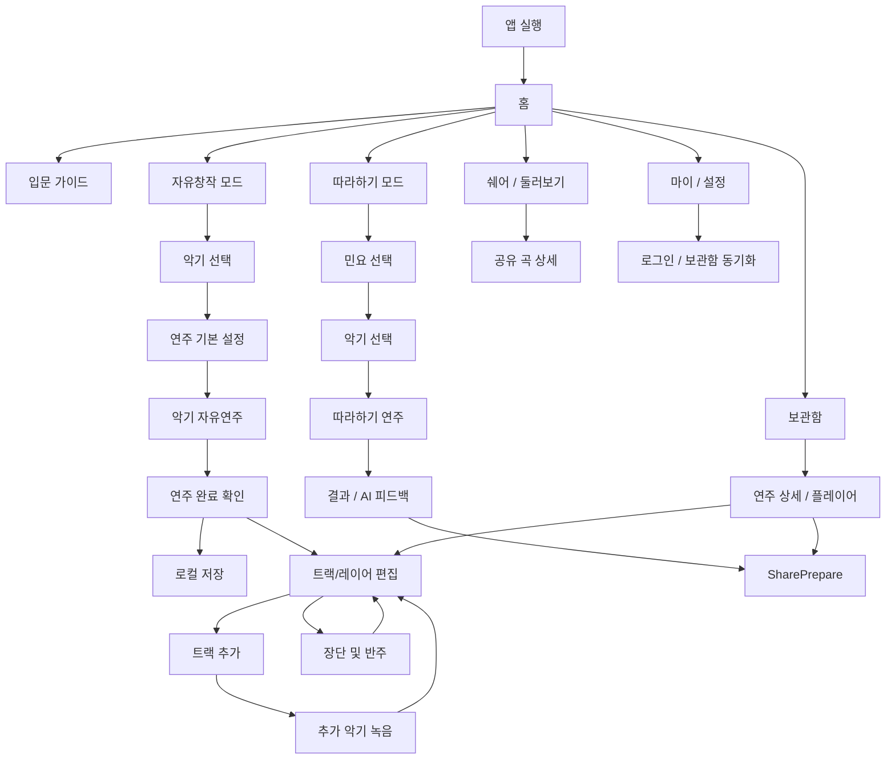

# GARAK 화면 흐름 정의

상태: 작업 초안
작성일: 2026-06-11
문서 책임: GARAK의 현재 화면 목적, CTA, 화면 연결, 데이터 흐름, 미정 사항을 한곳에 정리한다.

관련 문서: `../garak-product-brief.md`, `../../document-authority-index.md`

이 문서는 구현 계획이 아니다. 실제 구현 순서, 파일 경로, 테스트 명령은 이후 `docs/plans/implementation/` 문서에서 다룬다. 화면 변경 이력은 `changes/` 하위 문서에 분리한다.

## 1. 기준 결정

### 브랜드

- 정식 서비스명은 `GARAK`이다.
- 부제는 `AI GUGAK STUDIO`이다.
- 화면 문구에서 브랜드를 설명할 때는 "AI와 함께 만드는 나만의 국악, GARAK"처럼 서비스명과 부제를 분리해서 사용한다.

### 언어 원칙

- 제품 문서와 화면 명세는 한국어로 작성한다.
- 화면에 실제 노출되는 영어 문구, 브랜드명, 기술 고유명사는 필요한 경우에만 병기한다.
- 영어 지원은 제품 기능으로 다루되, 문서의 기본 언어는 한국어로 유지한다.

### 첫 실행과 로그인

- 앱은 기본적으로 게스트 상태로 바로 홈에 진입한다.
- 첫 실행 화면에서 "로그인 없이 시작하기"를 별도 관문으로 만들지 않는다.
- 로그인은 사용자가 필요를 느끼는 시점에 자연스럽게 제안한다.
- 로그인 이유는 "아이디에 저장된 내가 만든 곡 불러오기", "다른 기기에서 이어하기", "내 GARAK 보관함 동기화"로 설명한다.

### 내비게이션

- MVP에서는 모든 화면에 붙는 전역 하단 탭을 두지 않는다.
- 홈은 허브 역할을 한다.
- 연주 화면은 몰입을 우선하고, 하단에는 전역 탭이 아니라 연주 중 필요한 컨텍스트 컨트롤을 둔다.
- Figma의 `마이 / 홈 / 쉐어`는 전역 하단바가 아니라 홈 주변의 빠른 접근 UI로 해석한다.

### AI 범위

- MVP에서 AI 반주는 생성형 오디오가 아니라 장단 추천과 로컬 장단 시퀀싱이다.
- 추천은 자동 적용하지 않는다. 사용자가 미리듣고 수락해야 한다.
- 결과 화면의 AI 피드백은 데모 레이어로 둔다. 실제 API가 실패하거나 빠져도 로컬 템플릿 피드백으로 대체 가능해야 한다.

### MVP 악기 범위

- GARAK은 가야금 중심 앱이 아니라 국악 창작 앱이다.
- MVP에서 구현 목표로 삼는 악기는 가야금, 장구, 대금이다.
- 홈 화면은 Figma의 `자유창작 모드 / 따라하기 모드` 토글을 우선한다.
- 가야금, 장구, 대금 선택은 자유창작 또는 따라하기 흐름 안에서 드러낸다.
- 악기 선택 화면의 `잠금` 악기는 가야금, 장구, 대금의 미완성 표시가 아니다.
- `잠금` 악기는 MVP 이후 새 악기를 업데이트할 수 있음을 보여주는 확장 슬롯이다.
- 악기별 연주 화면은 같은 `Session`과 `PerformanceEvent[]` 모델을 공유하되, 입력 방식과 시각화는 악기별로 다르게 정의한다.

### 샘플 / 음원 데이터 원칙

- 국립국악원 디지털음원 자료를 주요 원천 후보로 둔다.
- 정상 연주 중 앱이 국립국악원 사이트를 직접 호출하지 않는다.
- 백엔드는 필요한 음원을 내려받고, 권리/출처/품질을 확인한 뒤 서버에 저장한 샘플 데이터를 앱에 제공한다.
- 앱은 서버의 `SampleAssetManifest`를 받아 필요한 샘플을 로컬 캐시로 저장한다.
- 첫 실행과 오프라인 대비를 위해 필수 데이터 일부는 앱 번들 또는 사전 캐시로 포함할 수 있다.
- 화면은 샘플 준비 상태를 숨기지 않는다. 필요하면 "준비 완료", "다운로드 필요", "기본 샘플 사용 중" 같은 상태를 표시한다.

## 2. 참고 자료

### Figma

- 파일: `2026 솔챌`
- 기준 프레임: `6/10`
- 확인된 요소:
  - `GARAK` 로고와 컬러 시안
  - 홈, 모드 선택, 악기 선택, 민요 선택, 연주 미리보기
  - 연주 완료, 트랙/레이어 편집, 마이, 쉐어 화면 와이어프레임

### HTML 와이어프레임

| 파일 | 역할 |
| --- | --- |
| `입문-가이드.html` | 연주법 입문 가이드, 농현/추성 튜토리얼 |
| `산조-가야금.html` | 12현 산조 가야금 실제 연주 화면 |
| `연주-모달.html` | 연주 중 하단 컨트롤과 장단/레이어/공유 액션 |
| `악기및-조율.html` | 악기 선택, 터치 민감도, 잔향, 연주 가이드 설정 |
| `장단및-반주.html` | BPM, 장단 선택, 볼륨 조정, 반주 적용 |
| `연주-보관함.html` | 저장된 연주 목록, 검색, 재생, 공유 |

### 현재 구현과 도메인 문서

- 현재 Expo 프로토타입은 12현 가야금 연주, 녹음 probe, 세션 fallback, 장단 preview를 포함한다.
- 현재 구현은 기술 검증의 출발점이며, 제품 화면 범위는 가야금, 장구, 대금 3악기로 확장한다.
- 도메인 기준 데이터는 `PerformanceEvent[]`이다.
- `Session`은 연주 이벤트를 보존하는 작업 단위다.
- `Recording`은 선택적 오디오 산출물이다.
- `JangdanRecommendation`은 자동 적용하지 않고 제안, 미리듣기, 수락 흐름을 따른다.

## 3. 전체 흐름 초안



## 4. 화면 인벤토리

| ID | 화면 | 목적 | 주요 CTA | 진입 | 다음 화면 | MVP |
| --- | --- | --- | --- | --- | --- | --- |
| S01 | 홈 | 사용자가 자유창작 모드와 따라하기 모드 중 현재 연주 흐름을 먼저 고르게 한다. | 자유창작 모드, 따라하기 모드, Next, 보관함, 쉐어, 설정 | 앱 실행 | S03, S04, S12, S18, S20, S22 | 필수 |
| S02 | 언어 전환 상태 | 홈에서 한국어/영어 표시를 바꾼다. | English, 한국어 | S01 | S01 | 필수 |
| S03 | 입문 가이드 | 농현, 추성 등 핵심 제스처를 짧게 학습시킨다. | 다음 단계로, 건너뛰기 | S01, 첫 연주 전 추천 | S05 또는 S04 | 권장 |
| S04 | 악기 선택 | 자유창작 모드에서 가야금, 장구, 대금 중 연주할 악기를 고른다. 추후 악기 확장 슬롯은 잠금 아이콘으로 보여준다. | 악기 선택, Next | S01, S05 | S04A 또는 이전 화면 | 필수 |
| S04A | 연주 기본 설정 | 선택한 악기에 맞는 기본 설정값을 확인하고 필요하면 조정한다. 초보자는 기본값으로 바로 시작하도록 유도한다. | 기본값으로 시작, 직접 조정, Next | S04 | S05 또는 S04 | 필수 |
| S05 | 악기 자유연주 | 선택한 악기를 화면 중심에 두고 직접 연주하고 녹음한다. 세세한 레이어/박자 편집은 담당하지 않는다. | 녹음, 완료, 장단, 레이어 편집 | S01, S03, S04A | S06, S07, S10 | 필수 |
| S06 | 연주 완료 확인 | 현재 테이크를 보관함에 저장할지, 레이어 편집으로 확장할지, 다시 연주할지 결정한다. | 보관함에 저장, 레이어 편집, 다시 연주 | S05 | S07, S18, S05 | 필수 |
| S07 | 트랙/레이어 편집 | 여러 트랙과 반주를 박자 그리드 위에 레이어로 쌓고 간단히 편집한다. | 트랙 추가, 위치 조정, 볼륨, mute/solo, 저장 | S06, S18 | S08, S10, S16 | 필수 |
| S08 | 트랙 추가 | 추가할 악기나 트랙 유형을 선택한다. | 가야금 선택, 장구 선택, 대금 선택, 취소 | S07 | S09 또는 S07 | 필수 |
| S09 | 추가 악기 녹음 | 기존 트랙을 들으며 선택한 악기를 추가로 연주하고 녹음한다. | 녹음 시작/중지, 적용 | S08 | S07 | 필수 |
| S10 | 장단 및 반주 패널 | BPM, 장단, 볼륨을 조정하고 반주를 적용한다. | 미리듣기, 반주 적용하기 | S05, S07 | S05 또는 S07 | 필수 |
| S11 | 반주 적용 후 트랙/레이어 편집 | AI 반주가 트랙으로 추가된 상태를 확인한다. | 저장, 다시 조정 | S10 | S07, S16 | 필수 |
| S12 | 따라하기 모드 상태 | 홈에서 따라하기 모드를 선택한 상태를 보여주고 민요 선택으로 진입한다. | 따라하기 모드, Next | S01 | S13 | 필수 |
| S13 | 민요 선택 | 따라할 민요를 선택한다. | Arirang 선택, Doraji 선택, Batnori 선택 | S12 | S14 | 필수 |
| S14 | 따라하기 악기 선택 | 선택한 민요를 어떤 악기로 따라할지 고른다. | 가야금 선택, 장구 선택, 대금 선택 | S13 | S15 | 필수 |
| S15 | 따라하기 연주 | 악보/가이드 하이라이트에 맞춰 연주한다. | 시작, 완주, 중단 | S14 | S16 | 필수 |
| S16 | 결과 / AI 피드백 | 정확도와 피드백을 보여주고 공유로 연결한다. | Share, 다시 연주, 저장 | S15 | S15, S17, S18 | 필수 |
| S17 | 공유 준비 | 저장된 연주 또는 결과를 공유할 제목, 미리보기, 대상 채널을 정한다. | 공유하기, 저장만 하기 | S16, S19 | S18 또는 S20 | 필수 |
| S18 | 보관함 | 저장한 연주를 검색하고 재생한다. | 들어보기, 공유, 더보기 | S01, S22, S23 | S17, S19, S07 | 필수 |
| S19 | 연주 상세 / 플레이어 | 저장된 곡을 듣고 트랙/레이어 편집 또는 공유로 이동한다. | 재생, 편집으로 열기, 공유 | S18 | S07, S17 | 필수 |
| S20 | 쉐어 / 둘러보기 | 다른 사용자의 GARAK을 둘러본다. | 재생, 리믹스, 저장 | S01, S17 | S21, S07 | 권장 |
| S21 | 공유 곡 상세 | 공유 곡을 자세히 듣고 리믹스한다. | 재생, 리믹스, 저장 | S20 | S07, S18 | 권장 |
| S22 | 마이 / 설정 | 계정, 언어, 보관함 동기화, 앱 설정으로 이동한다. | 로그인하고 내 곡 불러오기, 언어 변경 | S01 | S23, S02 | 필수 |
| S23 | 로그인 / 보관함 동기화 | 계정에 저장된 곡을 불러오거나 현재 로컬 곡을 동기화한다. | 로그인, 동기화, 나중에 하기 | S22, S18 | S18, S22 | 권장 |

## 5. 화면별 상세 명세 템플릿

각 화면은 아래 항목을 빠짐없이 검토한다. 화면 하나라도 이 템플릿을 건너뛰지 않는다.

```text
화면 ID:
화면 이름:

1. 화면 목적
-

2. 사용자 상태
- 게스트:
- 로그인:
- 언어:
- 진행 중 세션:

3. 주요 CTA
-

4. 보조 CTA
-

5. 표시 정보
-

6. 읽는 데이터
-

7. 쓰는 데이터
-

8. 샘플 / 에셋 상태
-

9. 생성되는 도메인 이벤트
-

10. 다음 화면 연결
-

11. 빈 상태 / 로딩 / 오류
-

12. Figma에서 가져올 요소
-

13. HTML에서 가져올 요소
-

14. 논의 필요사항
-
```

## 6. 데이터 흐름 초안

### 샘플 데이터 준비

```text
국립국악원 디지털음원 등 원천 자료
  -> 백엔드 다운로드 / 정리
  -> 권리 / 출처 / 품질 확인
  -> 서버 샘플 저장소
  -> SampleAssetManifest
  -> 앱 로컬 캐시 또는 필수 샘플 번들
  -> 악기 연주 화면 preload
```

- 앱은 공공 음원 원천 사이트를 런타임 의존성으로 삼지 않는다.
- 악기 화면 진입 전 선택 악기의 필수 샘플 준비 상태를 확인한다.
- 준비되지 않은 악기는 홈 또는 설정에서 다운로드 필요 상태를 보여준다.
- 필수 샘플이 준비되지 않으면 해당 악기 연주는 시작하지 않고 명시적인 안내를 보여준다.

### 게스트 저장

```text
연주 입력
  -> GestureMapper
  -> PerformanceEvent[]
  -> Session
  -> 로컬 보관함
```

- 게스트도 로컬 보관함에 곡을 저장할 수 있다.
- 로컬 저장 곡은 로그인 전에도 재생, 편집, 공유 준비가 가능해야 한다.
- 로그인 전 클라우드 동기화는 하지 않는다.

### 로그인 후 곡 불러오기

```text
마이 / 설정
  -> 로그인하고 내 곡 불러오기
  -> 계정 보관함 조회
  -> 로컬 보관함과 병합 또는 선택 동기화
```

- 로그인은 앱 사용의 선행 조건이 아니다.
- 로그인 유도는 저장/복구/다른 기기 이어하기의 이유가 있을 때만 보여준다.

### 자유연주

```text
악기별 터치 / 제스처 입력
  -> 악기별 PerformanceEvent
  -> SamplerEngine
  -> SessionRecorder
  -> Recording 선택 생성
```

### 장단 및 반주

```text
Session.events
  -> JangdanMatcher
  -> JangdanRecommendation
  -> 미리듣기
  -> 사용자 수락
  -> LocalSequencer
  -> 반주 트랙 추가
```

### 따라하기

```text
민요 선택
  -> 기준 가이드 패턴
  -> 사용자 PerformanceEvent[]
  -> 타이밍 정확도 계산
  -> 결과 점수
  -> AI 또는 로컬 템플릿 피드백
```

## 7. 보류 / 미정 사항

| 항목 | 현재 판단 | 확정 필요 |
| --- | --- | --- |
| 가야금 | MVP 실제 연주 대상 | 12현 표현과 조율 기본값 |
| 장구 | MVP 실제 연주 대상 | 패드형 입력, 장단 입력, 녹음 방식 |
| 대금 | MVP 실제 연주 대상 | 터치/호흡 표현을 모바일 입력으로 어떻게 단순화할지 |
| 샘플 데이터 | 백엔드 저장 + 앱 캐시를 기본으로 함 | 필수 번들 범위와 다운로드 실패 fallback |
| AI 피드백 | 데모 레이어로 가능 | 실제 API 사용 여부와 fallback 문구 |
| SNS 공유 | 공모전 시연 포인트로 중요 | 실제 공유 범위와 저장 산출물 |
| 영어 지원 | 홈과 따라하기 결과에서 가치가 큼 | 전체 다국어 범위 |
| 전역 하단 탭 | MVP에서는 사용하지 않음 | 홈 빠른 접근 UI의 형태 |

## 8. 화면별 검토 순서

1. 홈
2. 입문 가이드
3. 악기 선택
4. 연주 기본 설정
5. 악기 자유연주
6. 연주 완료 확인
7. 트랙/레이어 편집
8. 트랙 추가와 추가 악기 녹음
9. 장단 및 반주
10. 따라하기 진입과 민요 선택
11. 따라하기 연주
12. 결과 / AI 피드백
13. 공유 준비
14. 보관함
15. 연주 상세 / 플레이어
16. 쉐어 / 둘러보기
17. 마이 / 설정
18. 로그인 / 보관함 동기화

## 9. 화면별 상세 검토

### S01 홈

검토 상태: 진행 중

#### 확정된 결정

- 홈의 1차 선택은 `자유창작 모드 / 따라하기 모드`이다.
- 이 결정은 Figma C안, 즉 상단 segmented toggle로 연주 모드를 고르는 디자이너 의도를 따른다.
- 홈은 `연주 모드를 선택해요.`를 중심 질문으로 둔다.
- 홈 중앙의 큰 카드는 선택된 모드 설명을 보여준다.
- `자유창작 모드`를 선택하고 `Next`를 누르면 S04 `악기 선택`으로 이동한다.
- `따라하기 모드`를 선택하고 `Next`를 누르면 S13 `민요 선택`으로 이동한다.
- 가야금, 장구, 대금은 홈의 첫 선택지가 아니라 자유창작/따라하기 흐름 안에서 선택한다.
- 세 악기를 같은 크기의 카드 3개로 나열하지 않고, Figma의 큰 단일 카드 감각을 홈의 기본 시각 방향으로 존중한다.

#### 결정 재검토

- 재검토일: 2026-06-15
- 재검토 질문: "2026-06-11에 정한 S01 홈 결정, 즉 Figma C안처럼 홈의 1차 선택을 자유창작 모드 / 따라하기 모드 토글로 두고, 악기 선택은 이후 흐름에서 처리한다는 결정이 여전히 유효한가요?"
- 이유: 현재 결정은 화면 흐름 검토를 위한 기준점이며, 프로젝트 종료까지 고정되는 영구 결정이 아니다.

#### 1. 화면 목적

- 사용자가 앱을 열자마자 로그인 관문 없이 홈에 들어온다.
- 사용자가 자유창작 모드와 따라하기 모드 중 현재 연주 흐름을 먼저 고른다.
- 선택한 모드에 맞는 설명을 확인하고 `Next`로 다음 화면에 이동한다.

#### 2. 사용자 상태

- 게스트: 기본 상태다. 홈 진입, 모드 선택, 다음 화면 진입, 로컬 보관함 접근이 가능해야 한다.
- 로그인: 계정 보관함 동기화 상태와 내 곡 불러오기 상태를 표시할 수 있다.
- 언어: 상단 언어 전환에서 한국어/영어를 바꾼다.
- 진행 중 세션: 임시 저장된 세션이 있으면 이어하기 진입을 제공할 수 있다.

#### 3. 주요 CTA

- 모드 선택: `자유창작 모드`, `따라하기 모드`
- Next: 선택된 모드에 따라 S04 또는 S13으로 이동한다.

#### 4. 보조 CTA

- 입문 가이드
- 보관함
- 쉐어 / 둘러보기
- 마이 / 설정

#### 5. 표시 정보

- `GARAK` 로고
- 언어 전환
- `자유창작 모드 / 따라하기 모드` segmented toggle
- 선택된 모드 중심의 큰 설명 카드
- 선택된 모드의 짧은 설명
- Next 버튼
- 홈 전용 빠른 접근 UI: `마이 / 홈 / 쉐어`

#### 14. 논의 필요사항

- 따라하기 모드에서 S13 민요 선택 후 S14 악기 선택으로 갈지, 일부 민요는 추천 악기를 먼저 제안할지 정해야 한다.

### S04 악기 선택

검토 상태: 부분 확정

#### 확정된 결정

- MVP에서 실제로 선택하고 연주할 수 있는 악기는 `가야금`, `장구`, `대금`이다.
- S04는 악기 선택에 집중한다. 악기별 기본 설정 확인과 조정은 S04A `연주 기본 설정`에서 다룬다.
- Figma의 `잠금` 악기는 현재 MVP 3악기의 미구현 상태를 뜻하지 않는다.
- `잠금` 악기는 추후 악기를 업데이트할 수 있음을 보여주는 확장 슬롯이다.
- 추후 새 악기가 구현되면 잠금 슬롯 자리에 새로운 악기 요소를 추가한다.
- 잠금 슬롯은 선택 가능한 악기와 시각적으로 구분되어야 하며, `Next`의 선택 대상이 되지 않는다.
- 잠금 슬롯에는 실제 악기명을 미리 노출하지 않고 잠금 아이콘만 둔다.
- 잠금 슬롯을 누르면 짧은 안내를 보여준다. 기본 문구는 `새로운 악기가 업데이트될 예정이에요.`로 둔다.

#### 1. 화면 목적

- 자유창작 모드에서 사용자가 연주할 악기를 고른다.
- 사용자가 가야금, 장구, 대금 중 하나를 선택하면 해당 악기의 설명을 확인한다.
- MVP 이후 더 많은 악기가 추가될 수 있음을 잠금 슬롯으로 암시한다.

#### 3. 주요 CTA

- 가야금 선택
- 장구 선택
- 대금 선택
- Next: 선택한 악기의 S04A `연주 기본 설정` 화면으로 이동한다.

#### 5. 표시 정보

- 선택 가능한 MVP 악기: 가야금, 장구, 대금
- 추후 확장용 잠금 아이콘 슬롯
- 선택된 악기의 설명
- 선택된 악기의 샘플 준비 상태

#### 11. 빈 상태 / 로딩 / 오류

- 선택 가능한 MVP 악기의 샘플이 준비되지 않은 경우에는 `다운로드 필요`, `준비 중`, `기본 샘플 사용 중` 상태를 표시한다.
- 잠금 악기는 오류 상태가 아니다. 선택 불가 상태이며, 추후 업데이트 예정 악기 슬롯으로 처리한다.
- 잠금 슬롯 터치 시 오류나 이동 대신 `새로운 악기가 업데이트될 예정이에요.` 안내를 표시한다.

#### 14. 논의 필요사항

- S04의 선택 악기 설명을 소리 중심으로 쓸지, 연주 방식 중심으로 쓸지 정해야 한다.

### S04A 연주 기본 설정

검토 상태: 부분 확정

#### 확정된 결정

- S04A는 S04에서 선택한 악기의 기본 설정값을 확인하는 화면이다.
- S04A의 설정 항목은 공통 라벨로 고정하지 않고 악기별로 다르게 정의한다.
- 장구나 대금처럼 잔향 설정이 필요 없는 악기에는 잔향 항목을 보여주지 않는다.
- 초보자는 설정을 건드리지 않고 악기별 기본값으로 시작하도록 유도한다.
- 1차 CTA는 `기본값으로 시작`이다.
- 악기별 설정 항목은 조정 가능하지만 필수 조작으로 보이지 않아야 한다.
- 사용자가 직접 조정하지 않아도 선택 악기는 연주 가능한 기본 상태로 준비되어야 한다.

#### 1. 화면 목적

- 사용자가 선택한 악기의 기본 연주 상태를 확인한다.
- 초보자는 기본값으로 바로 S05 `악기 자유연주`에 진입한다.
- 필요한 사용자는 선택 악기에 맞는 설정값을 가볍게 조정한 뒤 연주로 진입한다.

#### 2. 사용자 상태

- 게스트: 기본값 시작과 직접 조정이 모두 가능하다.
- 로그인: 계정에 저장된 악기별 선호 설정이 있으면 기본값 대신 불러올 수 있다.
- 언어: 한국어/영어 표시를 따른다.
- 진행 중 세션: 새 자유창작 세션을 시작하기 전 설정 상태다.

#### 3. 주요 CTA

- 기본값으로 시작: default 설정으로 S05 `악기 자유연주`에 진입한다.
- Next: 사용자가 조정한 설정으로 S05 `악기 자유연주`에 진입한다.

#### 4. 보조 CTA

- 직접 조정
- 이전: S04 `악기 선택`으로 돌아간다.

#### 5. 표시 정보

- 선택된 악기명
- 선택된 악기의 기본 설정 요약
- 선택된 악기에 필요한 설정 컨트롤만 표시
- 가야금 예시: 조율, 터치 민감도, 잔향
- 장구 예시: 타격 민감도, 장단 기준 속도, 타격면 표시
- 대금 예시: 운지 입력 방식, 호흡 입력 민감도, 음정 안정 보조

#### 6. 읽는 데이터

- 선택된 `Instrument`
- 악기별 setting schema
- 악기별 기본 설정 preset
- 로컬 또는 계정 기반 악기별 선호 설정
- 선택 악기의 샘플 준비 상태

#### 7. 쓰는 데이터

- 새 `Session`의 `instrumentId`
- 새 `Session`의 초기 연주 설정
- 사용자가 저장을 선택한 경우 악기별 선호 설정

#### 8. 샘플 / 에셋 상태

- 선택 악기의 필수 샘플 준비 상태를 확인한다.
- 필수 샘플이 준비되지 않으면 S05로 이동하지 않고 다운로드/기본 샘플/fallback 상태를 안내한다.

#### 10. 다음 화면 연결

- 기본값으로 시작 또는 Next -> S05 `악기 자유연주`
- 이전 -> S04 `악기 선택`

#### 14. 논의 필요사항

- 각 악기의 S04A setting schema와 default 값은 악기별로 따로 정해야 한다.
- 사용자가 조정한 값을 자동 저장할지, 명시적으로 저장할지 정해야 한다.

### S05 악기 자유연주

검토 상태: 확정

#### 확정된 결정

- S05는 선택한 악기를 직접 연주하는 화면이다.
- S05의 중심은 편집 UI가 아니라 악기별 연주면이다.
- 가야금, 장구, 대금은 같은 S05 공통 프레임을 쓰되, 중앙의 연주 영역은 악기별로 다르게 구성한다.
- 상단/하단의 기본 조작은 공통으로 유지한다.
- 세세한 레이어 편집, 박자 그리드 편집, 트랙 위치 조정은 S05가 아니라 S07 `트랙/레이어 편집`에서 담당한다.
- S05의 `장단`은 별도 편집 화면으로 이동하는 기능이 아니라 S10 `장단 및 반주 패널`을 하단 패널로 여는 기능이다.
- S05에서 여는 S10은 라이브 장단 가이드/반주만 다루며, 트랙 편집은 하지 않는다.
- S05와 S06의 CTA 용어는 `레이어 편집`으로 통일한다.
- 버튼 공간이 좁은 화면에서는 `레이어`로 줄여 표시할 수 있지만, 의미는 S07 `트랙/레이어 편집`으로 이동하는 것이다.
- 사용자 관점에서 `연주`와 `녹음`은 다르다. S05에 진입하면 바로 연주할 수 있지만, `녹음`을 눌러야 현재 연주가 하나의 테이크로 남는다.
- 녹음 버튼을 누른 순간부터 현재 테이크는 저장 가능한 대상으로 본다. 녹음 시간이 짧거나 실제 연주음이 없어도 테이크는 존재한다.
- `PerformanceEvent[]`는 사용자에게 노출되는 개념이 아니라 내부 기록 모델이다.
- 사용자에게는 `테이크`, `녹음`, `연주` 언어를 사용한다.
- 녹음 없이 `완료`를 누르면 S06으로 이동하지 않고 S05 안에서 저장할 테이크가 없음을 안내한다.
- 녹음 중 `완료`를 누르면 현재 테이크를 마감하고, 필요한 변환/렌더링/저장 처리를 시작한 뒤 S06 `연주 완료 확인`으로 이동한다.
- 무거운 오디오 인코딩, 렌더링, 저장 처리는 실시간으로 하지 않고 `녹음 중지` 또는 `완료` 이후에 수행한다.
- 완료 이후 처리 중 상태는 별도 화면을 만들지 않고 S05 위 오버레이로 보여준다. 처리 성공 시 S06으로 이동하고, 실패 시 S05에서 재시도할 수 있게 한다.
- S05에는 S04A 설정 버튼을 기본 노출하지 않는다. 조율/민감도/잔향 등 악기별 기본 설정 변경은 S04A에서 담당한다.
- 오디오 녹음 파일은 재생/공유용 파생 산출물로 취급한다.

#### 1. 화면 목적

- 사용자가 선택한 악기를 실제로 연주한다.
- 사용자가 원할 때 녹음을 시작해 현재 연주를 하나의 테이크로 남긴다.
- 사용자가 녹음 중지 또는 완료를 통해 연주 결과를 저장/확장 흐름으로 넘긴다.

#### 2. 사용자 상태

- 게스트: 연주, 녹음, 로컬 저장, 트랙/레이어 편집 이동이 가능해야 한다.
- 로그인: 계정 동기화 상태가 있더라도 연주 자체는 로그인에 의존하지 않는다.
- 언어: 한국어/영어 UI를 따른다.
- 진행 중 세션: S04A에서 선택한 악기와 기본 설정을 가진 새 세션 또는 트랙이 열린 상태다.
- 연주 대기: 악기 소리는 낼 수 있지만 아직 테이크를 남기지 않는 상태다.
- 녹음 중: 현재 연주가 테이크로 기록되는 상태다.
- 처리 중: 녹음 중지 또는 완료 이후 변환/렌더링/저장을 준비하는 상태다.
- 테이크 준비됨: S06 또는 S07로 넘길 수 있는 테이크가 있는 상태다.

#### 3. 주요 CTA

- 녹음: 테이크 기록을 시작하거나 중지한다.
- 장단: 라이브 연주용 장단 가이드/반주를 연다.
- 레이어 편집: S07 `트랙/레이어 편집`으로 이동한다.
- 완료: 현재 테이크가 있으면 마감하고 S06 `연주 완료 확인`으로 이동한다. 테이크가 없으면 S05 안에서 안내한다.

#### 4. 보조 CTA

- 취소 또는 뒤로가기

#### 5. 표시 정보

- 선택된 악기명
- 악기별 연주 영역
- 녹음 상태
- 테이크 진행 시간
- 장단 또는 BPM 상태

#### 6. 악기별 중앙 연주 영역

- 가야금: 12현을 중심으로 현 뜯기, 쓸기, 흔들기, 지음 입력을 직접 다룬다.
- 장구: 북편과 채편을 중심으로 좌/우 타격면, 타격 세기, 장단감 피드백을 직접 다룬다.
- 대금: 호흡 세기, 운지, 음정 변화, 지속음 피드백을 직접 다룬다.
- 중앙 연주 영역은 악기별로 다르지만, 녹음/장단/레이어 편집/완료 컨트롤은 공통으로 유지한다.

#### 7. 읽는 데이터

- 선택된 `Instrument`
- S04A에서 확정한 악기별 기본 설정
- 선택 악기의 `SampleAssetManifest`
- 현재 `Session`
- 선택된 `JangdanPreset`이 있으면 해당 프리셋

#### 8. 쓰는 데이터

- 현재 테이크의 내부 입력 기록
- `PerformanceEvent[]`
- `Session`
- 완료 후 선택적으로 `Recording`
- 트랙/레이어 편집에서 사용할 `Track`

#### 9. 샘플 / 에셋 상태

- S05 진입 전 선택 악기의 필수 샘플이 준비되어 있어야 한다.
- 필수 샘플이 없으면 S05가 아니라 S04A에서 차단한다.
- S05 내부에서는 샘플 로딩 실패 시 연주 입력을 시작하지 않고 명확한 오류를 보여준다.

#### 10. 생성되는 도메인 이벤트

- 가야금: 현 뜯기, 쓸기, 흔들기, 지음 등 가야금 전용 `PerformanceEvent`
- 장구: 좌/우 타격면 입력, 세기, 장단 패턴 입력 등 장구 전용 `PerformanceEvent`
- 대금: 운지/호흡 입력, 음정 변화, 지속음 등 대금 전용 `PerformanceEvent`

#### 11. 다음 화면 연결

- 완료 -> S06 `연주 완료 확인`
- 레이어 편집 -> S07 `트랙/레이어 편집`
- 장단 -> S10 `장단 및 반주 패널`을 하단 패널로 연다.
- 뒤로가기 -> S04A 또는 저장 확인

#### 12. 빈 상태 / 로딩 / 오류

- 샘플 로딩 중: 연주 입력을 잠시 막고 준비 상태를 표시한다.
- 녹음 없이 `완료`를 누른 경우: S06으로 이동하지 않는다. 저장할 테이크가 없음을 안내하고, 나가기 또는 계속 연주를 선택하게 한다.
- 녹음 버튼을 눌렀다가 짧게 중지한 경우: 실제 연주음이 없어도 테이크로 인정한다.
- 테이크 없이 `레이어 편집`을 누른 경우: 먼저 녹음한 뒤 레이어 편집을 할 수 있음을 안내한다. 단, 기존 세션에 트랙이 있으면 S07로 이동할 수 있다.
- 완료 후 처리 중: S05 위에 처리 오버레이를 띄우고 입력을 잠시 막는다.
- 완료 후 변환/렌더링 실패: 테이크 원본 기록을 보존하고 S05에서 재시도 또는 보관함 저장 실패 안내를 제공한다.

#### 13. Figma에서 가져올 요소

- 악기 화면을 중앙에 크게 두는 구성
- 하단의 단순한 진행/액션 영역
- 미니멀한 회색 와이어프레임 감각

#### 14. HTML에서 가져올 요소

- `산조-가야금.html`의 현 중심 연주 영역
- `연주-모달.html`의 녹음, 장단, 레이어, 공유 액션
- `장단및-반주.html`의 장단 진입 구조

#### 15. 후속 상세화

- 가야금, 장구, 대금 각각의 세부 입력 제스처와 샘플 매핑은 악기별 연주 상세 정의에서 다룬다.
- S10의 장단 프리셋 목록, BPM 기본값, 볼륨 기본값은 S10 상세 정의에서 다룬다.
