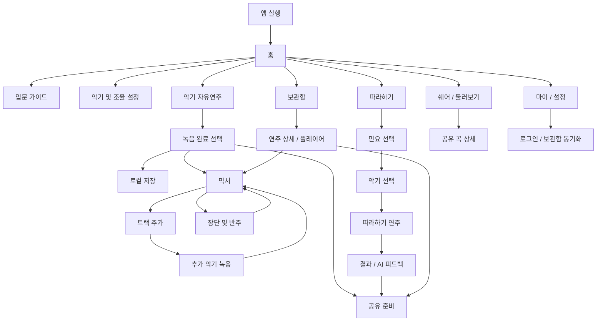

# GARAK 화면 흐름 정의

상태: 작업 초안
작성일: 2026-06-11
문서 책임: GARAK의 현재 화면 목적, CTA, 화면 연결, 데이터 흐름, 미정 사항을 한곳에 정리한다.

관련 문서: `../garak-product-brief.md`, `../../document-authority-index.md`

이 문서는 구현 계획이 아니다. 실제 구현 순서, 파일 경로, 테스트 명령은 이후 `docs/plans/implementation/` 문서에서 다룬다. 화면 변경 이력은 `changes/` 하위 문서에 분리한다.

## 1. 기준 결정

### 브랜드

- 정식 서비스명은 `GARAK`이다.
- 부제는 `AI GUGAK STUDIO`이다.
- 화면 문구에서 브랜드를 설명할 때는 "AI와 함께 만드는 나만의 국악, GARAK"처럼 서비스명과 부제를 분리해서 사용한다.

### 언어 원칙

- 제품 문서와 화면 명세는 한국어로 작성한다.
- 화면에 실제 노출되는 영어 문구, 브랜드명, 기술 고유명사는 필요한 경우에만 병기한다.
- 영어 지원은 제품 기능으로 다루되, 문서의 기본 언어는 한국어로 유지한다.

### 첫 실행과 로그인

- 앱은 기본적으로 게스트 상태로 바로 홈에 진입한다.
- 첫 실행 화면에서 "로그인 없이 시작하기"를 별도 관문으로 만들지 않는다.
- 로그인은 사용자가 필요를 느끼는 시점에 자연스럽게 제안한다.
- 로그인 이유는 "아이디에 저장된 내가 만든 곡 불러오기", "다른 기기에서 이어하기", "내 GARAK 보관함 동기화"로 설명한다.

### 내비게이션

- MVP에서는 모든 화면에 붙는 전역 하단 탭을 두지 않는다.
- 홈은 허브 역할을 한다.
- 연주 화면은 몰입을 우선하고, 하단에는 전역 탭이 아니라 연주 중 필요한 컨텍스트 컨트롤을 둔다.
- Figma의 `마이 / 홈 / 쉐어`는 전역 하단바가 아니라 홈 주변의 빠른 접근 UI로 해석한다.

### AI 범위

- MVP에서 AI 반주는 생성형 오디오가 아니라 장단 추천과 로컬 장단 시퀀싱이다.
- 추천은 자동 적용하지 않는다. 사용자가 미리듣고 수락해야 한다.
- 결과 화면의 AI 피드백은 데모 레이어로 둔다. 실제 API가 실패하거나 빠져도 로컬 템플릿 피드백으로 대체 가능해야 한다.

### MVP 악기 범위

- GARAK은 가야금 중심 앱이 아니라 국악 창작 앱이다.
- MVP에서 구현 목표로 삼는 악기는 가야금, 장구, 대금이다.
- 홈 화면은 특정 악기를 우선 판매하는 화면이 아니라 세 악기 중 오늘 연주할 악기를 고르는 허브여야 한다.
- 악기별 연주 화면은 같은 `Session`과 `PerformanceEvent[]` 모델을 공유하되, 입력 방식과 시각화는 악기별로 다르게 정의한다.

### 샘플 / 음원 데이터 원칙

- 국립국악원 디지털음원 자료를 주요 원천 후보로 둔다.
- 정상 연주 중 앱이 국립국악원 사이트를 직접 호출하지 않는다.
- 백엔드는 필요한 음원을 내려받고, 권리/출처/품질을 확인한 뒤 서버에 저장한 샘플 데이터를 앱에 제공한다.
- 앱은 서버의 `SampleAssetManifest`를 받아 필요한 샘플을 로컬 캐시로 저장한다.
- 첫 실행과 오프라인 대비를 위해 필수 데이터 일부는 앱 번들 또는 사전 캐시로 포함할 수 있다.
- 화면은 샘플 준비 상태를 숨기지 않는다. 필요하면 "준비 완료", "다운로드 필요", "기본 샘플 사용 중" 같은 상태를 표시한다.

## 2. 참고 자료

### Figma

- 파일: `2026 솔챌`
- 기준 프레임: `6/10`
- 확인된 요소:
  - `GARAK` 로고와 컬러 시안
  - 홈, 모드 선택, 악기 선택, 민요 선택, 연주 미리보기
  - 연주 완료, 믹서, 마이, 쉐어 화면 와이어프레임

### HTML 와이어프레임

| 파일 | 역할 |
| --- | --- |
| `입문-가이드.html` | 연주법 입문 가이드, 농현/추성 튜토리얼 |
| `산조-가야금.html` | 12현 산조 가야금 실제 연주 화면 |
| `연주-모달.html` | 연주 중 하단 컨트롤과 장단/레이어/공유 액션 |
| `악기및-조율.html` | 악기 선택, 터치 민감도, 잔향, 연주 가이드 설정 |
| `장단및-반주.html` | BPM, 장단 선택, 볼륨 믹서, 반주 적용 |
| `연주-보관함.html` | 저장된 연주 목록, 검색, 재생, 공유 |

### 현재 구현과 도메인 문서

- 현재 Expo 프로토타입은 12현 가야금 연주, 녹음 probe, 세션 fallback, 장단 preview를 포함한다.
- 현재 구현은 기술 검증의 출발점이며, 제품 화면 범위는 가야금, 장구, 대금 3악기로 확장한다.
- 도메인 기준 데이터는 `PerformanceEvent[]`이다.
- `Session`은 연주 이벤트를 보존하는 작업 단위다.
- `Recording`은 선택적 오디오 산출물이다.
- `JangdanRecommendation`은 자동 적용하지 않고 제안, 미리듣기, 수락 흐름을 따른다.

## 3. 전체 흐름 초안



## 4. 화면 인벤토리

| ID | 화면 | 목적 | 주요 CTA | 진입 | 다음 화면 | MVP |
| --- | --- | --- | --- | --- | --- | --- |
| S01 | 홈 | 사용자가 가야금, 장구, 대금 중 오늘 연주할 악기를 고르고 바로 창작을 시작하게 한다. | 악기 선택, 연주 시작, 따라하기, 보관함, 쉐어, 설정 | 앱 실행 | S03, S04, S05, S12, S18, S20, S22 | 필수 |
| S02 | 언어 전환 상태 | 홈에서 한국어/영어 표시를 바꾼다. | English, 한국어 | S01 | S01 | 필수 |
| S03 | 입문 가이드 | 농현, 추성 등 핵심 제스처를 짧게 학습시킨다. | 다음 단계로, 건너뛰기 | S01, 첫 연주 전 추천 | S05 또는 S04 | 권장 |
| S04 | 악기 및 조율 설정 | 가야금, 장구, 대금의 악기별 조율, 터치 민감도, 잔향, 가이드 표시를 설정한다. | 설정 저장하기 | S01, S05 | S05 또는 이전 화면 | 필수 |
| S05 | 악기 자유연주 | 선택한 악기를 직접 연주하고 녹음한다. | 녹음 시작/중지, 저장, 장단, 레이어, 공유 | S01, S03, S04 | S06, S10, S16 | 필수 |
| S06 | 녹음 완료 선택 | 연주를 저장할지, 믹서로 확장할지, 공유할지 결정한다. | 저장, 믹서로 이동, 공유 | S05 | S07, S16, S17 | 필수 |
| S07 | 믹서 | 여러 트랙과 반주를 한 세션으로 조합한다. | 트랙 추가, AI 반주 생성, 저장 | S06, S18 | S08, S10, S16 | 필수 |
| S08 | 트랙 추가 | 추가할 악기나 트랙 유형을 선택한다. | 가야금 선택, 장구 선택, 대금 선택, 취소 | S07 | S09 또는 S07 | 필수 |
| S09 | 추가 악기 녹음 | 기존 트랙을 들으며 선택한 악기를 추가로 연주하고 녹음한다. | 녹음 시작/중지, 적용 | S08 | S07 | 필수 |
| S10 | 장단 및 반주 패널 | BPM, 장단, 볼륨을 조정하고 반주를 적용한다. | 미리듣기, 반주 적용하기 | S05, S07 | S05 또는 S07 | 필수 |
| S11 | 반주 적용 후 믹서 | AI 반주가 트랙으로 추가된 상태를 확인한다. | 저장, 공유, 다시 조정 | S10 | S07, S16 | 필수 |
| S12 | 따라하기 진입 | 따라하기 모드의 곡 선택으로 진입한다. | Practice Mode, 민요 선택 | S01 | S13 | 필수 |
| S13 | 민요 선택 | 따라할 민요를 선택한다. | Arirang 선택, Doraji 선택, Batnori 선택 | S12 | S14 | 필수 |
| S14 | 따라하기 악기 선택 | 선택한 민요를 어떤 악기로 따라할지 고른다. | 가야금 선택, 장구 선택, 대금 선택 | S13 | S15 | 필수 |
| S15 | 따라하기 연주 | 악보/가이드 하이라이트에 맞춰 연주한다. | 시작, 완주, 중단 | S14 | S16 | 필수 |
| S16 | 결과 / AI 피드백 | 정확도와 피드백을 보여주고 공유로 연결한다. | Share, 다시 연주, 저장 | S15 | S15, S17, S18 | 필수 |
| S17 | 공유 준비 | 공유할 제목, 미리보기, 대상 채널을 정한다. | 공유하기, 저장만 하기 | S06, S16, S19 | S18 또는 S20 | 필수 |
| S18 | 보관함 | 저장한 연주를 검색하고 재생한다. | 들어보기, 공유, 더보기 | S01, S22, S23 | S17, S19, S07 | 필수 |
| S19 | 연주 상세 / 플레이어 | 저장된 곡을 듣고 편집/믹서/공유로 이동한다. | 재생, 믹서로 열기, 공유 | S18 | S07, S17 | 필수 |
| S20 | 쉐어 / 둘러보기 | 다른 사용자의 GARAK을 둘러본다. | 재생, 리믹스, 저장 | S01, S17 | S21, S07 | 권장 |
| S21 | 공유 곡 상세 | 공유 곡을 자세히 듣고 리믹스한다. | 재생, 리믹스, 저장 | S20 | S07, S18 | 권장 |
| S22 | 마이 / 설정 | 계정, 언어, 보관함 동기화, 앱 설정으로 이동한다. | 로그인하고 내 곡 불러오기, 언어 변경 | S01 | S23, S02 | 필수 |
| S23 | 로그인 / 보관함 동기화 | 계정에 저장된 곡을 불러오거나 현재 로컬 곡을 동기화한다. | 로그인, 동기화, 나중에 하기 | S22, S18 | S18, S22 | 권장 |

## 5. 화면별 상세 명세 템플릿

각 화면은 아래 항목을 빠짐없이 검토한다. 화면 하나라도 이 템플릿을 건너뛰지 않는다.

```text
화면 ID:
화면 이름:

1. 화면 목적
-

2. 사용자 상태
- 게스트:
- 로그인:
- 언어:
- 진행 중 세션:

3. 주요 CTA
-

4. 보조 CTA
-

5. 표시 정보
-

6. 읽는 데이터
-

7. 쓰는 데이터
-

8. 샘플 / 에셋 상태
-

9. 생성되는 도메인 이벤트
-

10. 다음 화면 연결
-

11. 빈 상태 / 로딩 / 오류
-

12. Figma에서 가져올 요소
-

13. HTML에서 가져올 요소
-

14. 논의 필요사항
-
```

## 6. 데이터 흐름 초안

### 샘플 데이터 준비

```text
국립국악원 디지털음원 등 원천 자료
  -> 백엔드 다운로드 / 정리
  -> 권리 / 출처 / 품질 확인
  -> 서버 샘플 저장소
  -> SampleAssetManifest
  -> 앱 로컬 캐시 또는 필수 샘플 번들
  -> 악기 연주 화면 preload
```

- 앱은 공공 음원 원천 사이트를 런타임 의존성으로 삼지 않는다.
- 악기 화면 진입 전 선택 악기의 필수 샘플 준비 상태를 확인한다.
- 준비되지 않은 악기는 홈 또는 설정에서 다운로드 필요 상태를 보여준다.
- 필수 샘플이 준비되지 않으면 해당 악기 연주는 시작하지 않고 명시적인 안내를 보여준다.

### 게스트 저장

```text
연주 입력
  -> GestureMapper
  -> PerformanceEvent[]
  -> Session
  -> 로컬 보관함
```

- 게스트도 로컬 보관함에 곡을 저장할 수 있다.
- 로컬 저장 곡은 로그인 전에도 재생, 편집, 공유 준비가 가능해야 한다.
- 로그인 전 클라우드 동기화는 하지 않는다.

### 로그인 후 곡 불러오기

```text
마이 / 설정
  -> 로그인하고 내 곡 불러오기
  -> 계정 보관함 조회
  -> 로컬 보관함과 병합 또는 선택 동기화
```

- 로그인은 앱 사용의 선행 조건이 아니다.
- 로그인 유도는 저장/복구/다른 기기 이어하기의 이유가 있을 때만 보여준다.

### 자유연주

```text
악기별 터치 / 제스처 입력
  -> 악기별 PerformanceEvent
  -> SamplerEngine
  -> SessionRecorder
  -> Recording 선택 생성
```

### 장단 및 반주

```text
Session.events
  -> JangdanMatcher
  -> JangdanRecommendation
  -> 미리듣기
  -> 사용자 수락
  -> LocalSequencer
  -> 반주 트랙 추가
```

### 따라하기

```text
민요 선택
  -> 기준 가이드 패턴
  -> 사용자 PerformanceEvent[]
  -> 타이밍 정확도 계산
  -> 결과 점수
  -> AI 또는 로컬 템플릿 피드백
```

## 7. 보류 / 미정 사항

| 항목 | 현재 판단 | 확정 필요 |
| --- | --- | --- |
| 가야금 | MVP 실제 연주 대상 | 12현 표현과 조율 기본값 |
| 장구 | MVP 실제 연주 대상 | 패드형 입력, 장단 입력, 녹음 방식 |
| 대금 | MVP 실제 연주 대상 | 터치/호흡 표현을 모바일 입력으로 어떻게 단순화할지 |
| 샘플 데이터 | 백엔드 저장 + 앱 캐시를 기본으로 함 | 필수 번들 범위와 다운로드 실패 fallback |
| AI 피드백 | 데모 레이어로 가능 | 실제 API 사용 여부와 fallback 문구 |
| SNS 공유 | 공모전 시연 포인트로 중요 | 실제 공유 범위와 저장 산출물 |
| 영어 지원 | 홈과 따라하기 결과에서 가치가 큼 | 전체 다국어 범위 |
| 전역 하단 탭 | MVP에서는 사용하지 않음 | 홈 빠른 접근 UI의 형태 |

## 8. 화면별 검토 순서

1. 홈
2. 입문 가이드
3. 악기 및 조율 설정
4. 악기 자유연주
5. 녹음 완료 선택
6. 믹서
7. 트랙 추가와 추가 악기 녹음
8. 장단 및 반주
9. 따라하기 진입과 민요 선택
10. 따라하기 연주
11. 결과 / AI 피드백
12. 공유 준비
13. 보관함
14. 연주 상세 / 플레이어
15. 쉐어 / 둘러보기
16. 마이 / 설정
17. 로그인 / 보관함 동기화

## 9. 화면별 상세 검토

### S01 홈

검토 상태: 진행 중

#### 확정된 결정

- 홈의 1차 선택은 `악기 선택`이다.
- 홈은 `자유연주 / 따라하기` 같은 모드 선택보다 먼저 `가야금 / 장구 / 대금` 중 오늘 연주할 악기를 고르게 한다.
- 모드 선택은 악기 선택 이후의 다음 단계 또는 홈의 보조 CTA로 둔다.
- 선택된 악기에서 `연주 시작`을 누르면 설정 화면을 먼저 거치지 않고 S05 `악기 자유연주`로 바로 진입한다.
- S04 `악기 및 조율 설정`은 홈의 보조 CTA 또는 연주 화면 내부 설정 진입으로 둔다.
- 단, 선택 악기의 필수 샘플이 준비되지 않은 경우에는 S05로 진입시키지 않고 홈에서 샘플 준비 상태와 필요한 조치를 먼저 보여준다.
- 악기 선택 UI는 세 악기를 같은 크기의 카드 3개로 나열하기보다, Figma의 큰 단일 카드 감각을 따른다.
- 홈 중앙의 큰 카드는 선택된 악기를 중심으로 보여주고, 다른 악기는 좌우 이동, 하단 선택지, 또는 카드 내부 보조 선택 UI로 전환할 수 있게 한다.
- 디자이너가 잡아둔 미니멀한 카드 중심 인상을 홈의 기본 시각 방향으로 존중한다.

#### 결정 재검토

- 재검토일: 2026-06-15
- 재검토 질문: "2026-06-11에 정한 S01 홈 결정, 즉 홈의 1차 선택은 악기 선택이고 선택 악기의 연주 시작은 바로 자유연주(S05)로 진입한다는 결정이 여전히 유효한가요?"
- 이유: 현재 결정은 화면 흐름 검토를 위한 기준점이며, 프로젝트 종료까지 고정되는 영구 결정이 아니다.

#### 1. 화면 목적

- 사용자가 앱을 열자마자 로그인 관문 없이 홈에 들어온다.
- 사용자가 가야금, 장구, 대금 중 오늘 연주할 악기를 먼저 고른다.
- 선택한 악기로 바로 연주를 시작하거나, 따라하기/입문 가이드/보관함 같은 보조 흐름으로 이동한다.

#### 2. 사용자 상태

- 게스트: 기본 상태다. 홈 진입, 악기 선택, 연주 시작, 로컬 보관함 접근이 가능해야 한다.
- 로그인: 계정 보관함 동기화 상태와 내 곡 불러오기 상태를 표시할 수 있다.
- 언어: 상단 언어 전환에서 한국어/영어를 바꾼다.
- 진행 중 세션: 임시 저장된 세션이 있으면 이어하기 진입을 제공할 수 있다.

#### 3. 주요 CTA

- 악기 선택: `가야금`, `장구`, `대금`
- 선택 악기 연주 시작: 선택된 악기의 S05 `악기 자유연주` 화면으로 바로 이동한다.

#### 4. 보조 CTA

- 따라하기
- 입문 가이드
- 악기 및 조율
- 보관함
- 쉐어 / 둘러보기
- 마이 / 설정

#### 5. 표시 정보

- `GARAK` 로고
- 언어 전환
- 선택된 악기 중심의 큰 카드
- 전환 가능한 세 악기: 가야금, 장구, 대금
- 선택된 악기의 짧은 설명
- 선택된 악기의 샘플 준비 상태
- 홈 전용 빠른 접근 UI: `마이 / 홈 / 쉐어`

#### 14. 논의 필요사항

- 따라하기를 홈에서 악기 선택 이후로 보낼지, 곡 선택 이후 악기 선택으로 보낼지 정해야 한다.
