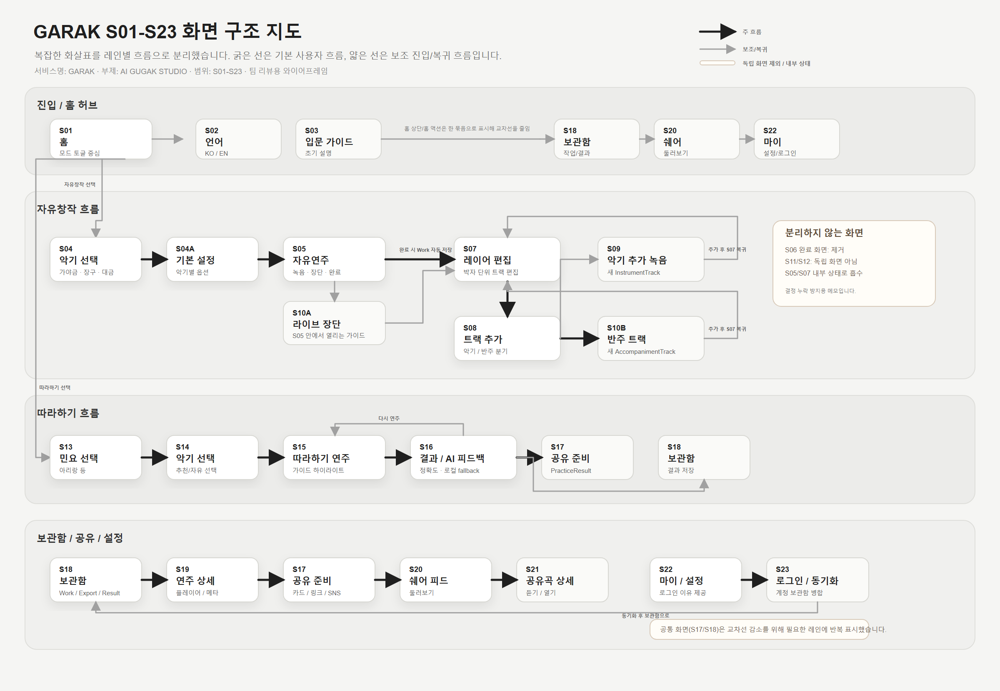

# S01-S23 Figma 이관용 와이어프레임

상태: 리뷰용 시각 자료 작성  
작성일: 2026-06-18  
관련 문서: `2026-06-18-s01-s23-screen-flow-visual-map.md`, `2026-06-18-s01-s23-screen-flow-implementation-report.md`

## 목적

S01-S23 화면 구조를 팀이 더 쉽게 검토할 수 있도록 Figma 이관용 SVG 와이어프레임으로 정리한다. 기존 Mermaid 지도는 화면 간 연결을 빠짐없이 보이기에는 좋지만, 모든 연결선이 한 그래프에 모여 팀 리뷰 시 화살표가 복잡하게 보일 수 있다.

## 산출물

- SVG: `assets/s01-s23-screen-flow-wireframe.svg`
- PNG 미리보기: `assets/s01-s23-screen-flow-wireframe.png`
- 용도: Figma에 가져가거나, 문서/PR 리뷰에서 화면 구조를 빠르게 확인하는 자료

## 시각화 원칙

1. 화면을 `진입 / 홈 허브`, `자유창작`, `따라하기`, `보관함 / 공유 / 설정` 레인으로 분리한다.
2. 굵은 화살표는 기본 사용자 흐름만 표현한다.
3. 얇은 화살표는 보조 진입, 복귀, 반복 흐름으로 낮춘다.
4. S17, S18처럼 여러 흐름에서 반복 사용되는 공통 화면은 교차선을 줄이기 위해 필요한 레인에 반복 표시한다.
5. S06, S11, S12처럼 독립 화면으로 두지 않기로 한 항목은 별도 메모 박스에 모아 결정 누락을 방지한다.

## Figma 반영 상태

현재 Figma 커넥터가 대상 파일을 `read-only mode`로 열고 있어 `createPage`, `createFrame`이 차단되었다. 따라서 직접 Figma 노드 생성은 보류하고, 동일 구조를 SVG로 먼저 기록한다.

Figma 쓰기 권한이 열리면 다음 순서로 이관한다.

1. 기존 `Idea` 페이지 오른쪽에 `S01-S23 화면 흐름 와이어프레임` 프레임을 추가한다.
2. SVG의 레인 구조와 카드 배치를 그대로 Figma 노드로 재구성한다.
3. 기존 `6/10` 섹션의 카드 감각과 디자인 시스템 색/버튼 규칙을 적용한다.
4. Mermaid 지도는 상세 참조용으로 유지하고, Figma 지도는 팀 리뷰용 요약 지도 역할로 둔다.
