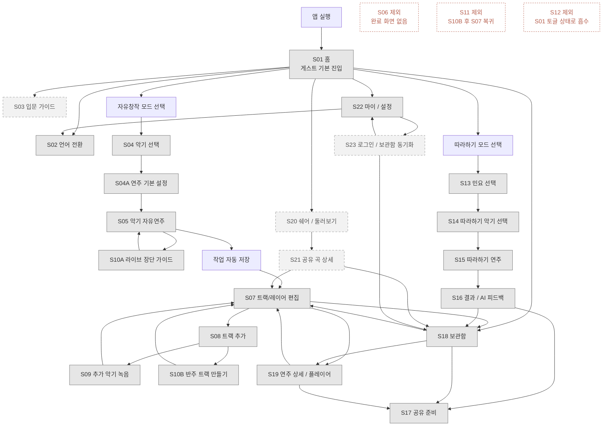
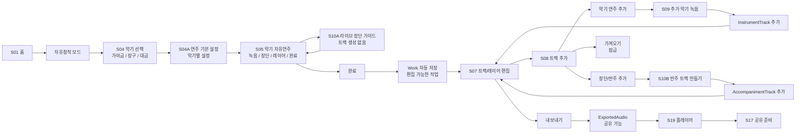
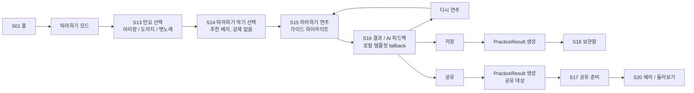
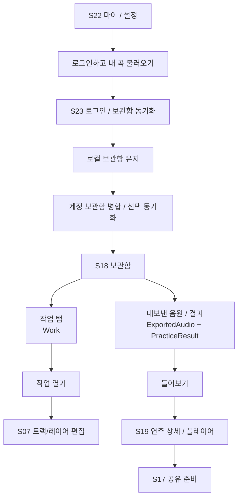
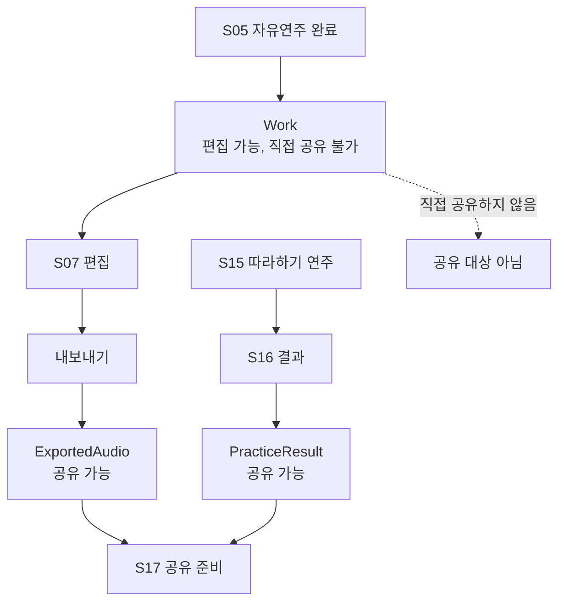

# S01-S23 화면 구조 시각 지도

상태: 팀 리뷰용 시각 자료
작성일: 2026-06-18
관련 문서: `2026-06-18-s01-s23-screen-flow-implementation-report.md`, `../product/screen-flow/current-screen-flow.md`

이 문서는 S01-S23 화면 구조를 팀이 빠르게 훑어볼 수 있도록 시각화한 자료다. 현재 기준 문서는 `../product/screen-flow/current-screen-flow.md`이며, 이 문서는 보고와 리뷰를 위한 보조 자료다.

## 1. 전체 화면 지도

## 2. 자유창작 흐름

## 3. 따라하기와 공유 흐름

## 4. 보관함과 로그인 흐름

## 5. 산출물 기준

## 6. 팀 리뷰 체크포인트

| 확인할 점 | 현재 구조 |
| --- | --- |
| 첫 실행 로그인 | 없음. S01 홈으로 바로 진입 |
| 홈 1차 선택 | 자유창작 모드 / 따라하기 모드 |
| MVP 악기 | 가야금, 장구, 대금 |
| 완료 후 이동 | S05 완료 -> Work 자동 저장 -> S07 |
| 라이브 장단과 반주 트랙 | S10A와 S10B로 책임 분리 |
| 공유 대상 | `ExportedAudio`, `PracticeResult` |
| 작업 공유 | 자동 저장된 `Work`는 직접 공유하지 않음 |
| 제외 화면 | S06, S11, S12 |
